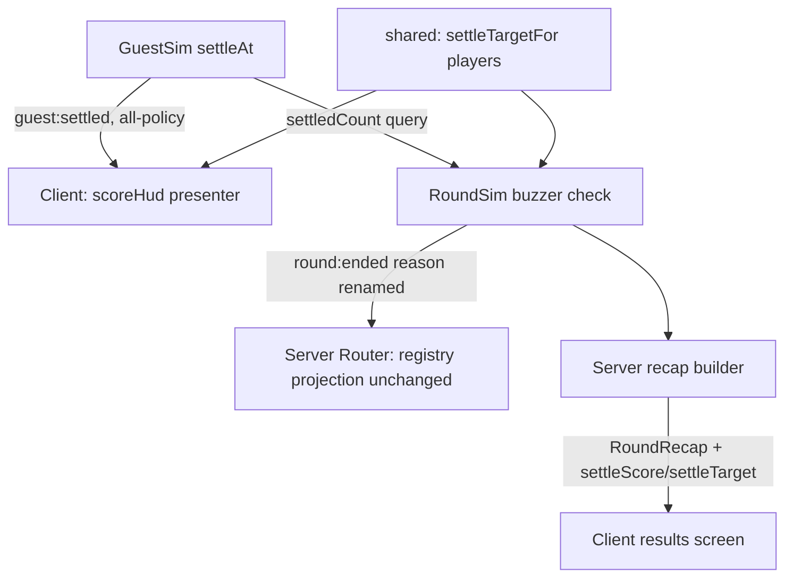

# delivery-scoring Design

**Spec**: `.specs/features/delivery-scoring/spec.md`
**Status**: Draft

---

## Architecture Overview

The feature rides three existing seams and adds one pure module; no new
protocol message and no new sim event.



- **Score source of truth**: the sim's guest settle count. `GuestSim` already
  emits `guest:settled` on every settle path (suitcase match + self-assign
  share `settleAt`, `packages/sim/src/guests.ts:588`); the wire policy is
  already `'all'` (`registry.ts:299`). The client HUD counts these events
  locally — counting a public, monotonic event stream client-side is
  derivable-from-known-info, so the leak rules are untouched.
- **Verdict**: `RoundSim`'s buzzer check (`roundSim.ts:265-273`) swaps the
  coverage comparison for `guests.settledCount >= settleTargetFor(playerCount)`.
  The reason union renames (`simEvents.ts:148`); the `round:ended` registry
  row and its projection are unchanged (they carry `reason` verbatim).
- **Recap**: `RoundRecap` (`messages.ts:454`) gains `settleScore` +
  `settleTarget` — a payload extension on the existing `'all'` row, assembled
  server-side as today.

## Code Reuse Analysis

### Existing Components to Leverage

| Component | Location | How to Use |
|---|---|---|
| `settleAt` shared settle path | `packages/sim/src/guests.ts:588` | Already the single settle chokepoint; `settledCount` is a counter beside it |
| `preppedCount` pattern | `packages/sim/src/work.ts:109` | Same shape: a getter query consumed by the buzzer check |
| `round:ended` projection | `packages/shared/src/protocol/registry.ts:526` | Unchanged — carries `reason` verbatim, rename is value-only |
| Pure presenter precedent | `apps/client/src/scenes/elevatorPresenter.ts` (AD-038) | The HUD follows the same pure, node-testable presenter pattern |
| Tuning module | `packages/shared/src/tuning.ts` | `SETTLE_TARGET` values + `settleTargetFor` helper live beside the other §7 dials |

### Integration Points

| System | Integration Method |
|---|---|
| Sim win check | Replace the coverage comparison in `RoundSim.tick` buzzer branch |
| Protocol | Value-only rename of two `RoundEndReason` strings; `RoundRecap` payload gains two fields |
| Client HUD | New presenter mounted by `WorldScene`, fed by the existing message dispatch |
| Results screen | Renders the renamed reason; recap panel renders score vs target |

## Components

### `settleTargetFor` (shared tuning)

- **Purpose**: The §7 dial as code — target settles per lobby size.
- **Location**: `packages/shared/src/tuning.ts`
- **Interfaces**: `settleTargetFor(playerCount: number): number` — 4p→5, 5p→7, 6p→9, clamped for out-of-range counts (larger lobbies take the 6p value; the prd row scales by lobby size later).
- **Dependencies**: none (pure).
- **Reuses**: the TUNING constant module conventions.

### `GuestSim.settledCount` (sim query)

- **Purpose**: Authoritative per-round settle total for the verdict and the recap.
- **Location**: `packages/sim/src/guests.ts`
- **Interfaces**: `get settledCount(): number` — incremented once per committed `settleAt`.
- **Dependencies**: none new.
- **Reuses**: `settleAt` as the only call site.

### Buzzer verdict swap (RoundSim)

- **Purpose**: The §6.6 check: score ≥ target → staff, else saboteur.
- **Location**: `packages/sim/src/roundSim.ts:265-273`
- **Interfaces**: unchanged `end(winner, reason)`; `RoundEndReason` union renamed.
- **Dependencies**: `GuestSim.settledCount`, `settleTargetFor`.
- **Reuses**: existing buzzer flush ordering (buzzer event, then `round:ended`).

### `scoreHud` presenter (client)

- **Purpose**: Maintain and render `Settled N / T`; reset on round start.
- **Location**: `apps/client/src/ui/scoreHud.ts` (pure, Phaser-free) + mount in `WorldScene`
- **Interfaces**: `onSettled()`, `reset()`, `render(): string` (or state object) — fed from the existing `guest:settled` dispatch; `T` from `settleTargetFor(currentRosterSize)`.
- **Dependencies**: message dispatch, shared tuning helper.
- **Reuses**: the AD-038 presenter pattern (state + pure render, node-tested).

### Recap extension (server + shared)

- **Purpose**: The results screen reads the final score vs target.
- **Location**: `RoundRecap` in `packages/shared/src/protocol/messages.ts`; recap builder in `apps/server`
- **Interfaces**: `RoundRecap.settleScore: number`, `RoundRecap.settleTarget: number`.
- **Dependencies**: `RoundSim` score/target queries at recap-build time.
- **Reuses**: existing recap assembly path (`fromSim` undefined; server-built, post-reveal).

## Data Models

```typescript
// simEvents.ts — value-only rename
export type RoundEndReason =
  | 'saboteur-fired'
  | 'staff-reduced'
  | 'settle-target-met'
  | 'settle-target-failed'

// messages.ts — payload extension on the existing 'all' row
export interface RoundRecap {
  readonly entries: readonly RecapEntry[]
  readonly settleScore: number
  readonly settleTarget: number
}
```

**Relationships**: the score counted by the HUD must equal the server's
`settledCount` at recap time — both derive from the same `guest:settled`
stream; the `client:score_hud` scenario pins the equality at round end.

## Error Handling Strategy

| Error Scenario | Handling | User Impact |
|---|---|---|
| Settle event received outside a running round (post-buzzer stragglers) | Sim already silences post-buzzer ticks (EVID-11); HUD ignores settles after `round:ended` | None — counter frozen at the verdict |
| Reconnect mid-round (`round:resumed`) | HUD re-seeds `N` from the resumed snapshot's settle count (added to the resume payload) and `T` from roster size | Correct counter after reconnect |
| Unexpected lobby size | `settleTargetFor` clamps to the 6p value | Deterministic target, never NaN/undefined |

The resume-payload field is the one seam the spec didn't name: `round:resumed`
already carries a restore snapshot (2.9); it gains the current settle score so
a reconnecting player's counter is exact rather than recounted from a stream
they never saw. Same leak posture as `round:recap` (public fact).

## Risks & Concerns

| Concern | Location (file:line) | Impact | Mitigation |
|---|---|---|---|
| Exact reason-string pins across three suites | `packages/sim/src/roundSim.test.ts:78,286,322`, `packages/shared/src/protocol/registry.test.ts:443-469` | Renames break pins mechanically | Update in the same commit as the rename; the REG-18 lesson (relaxed ordered pins) already covers the buzzer-flush adjacency |
| Client results screen may hardcode coverage wording | apps/client results/recap render path | Stale user-facing text | Sweep for `coverage` in `apps/client/src` within the rename task |
| `settledCount` vs HUD drift (missed dispatch) | client dispatch path | Counter lies vs recap | `client:score_hud` scenario ends by comparing the HUD count to the recap's `settleScore` |
| Coverage math silently still load-bearing | `roundSim.ts:269` is the only win-check use; `work.preppedCount` tests remain | None if confined | Keep `preppedCount` + its tests (telemetry/KPI future); only the verdict comparison moves |

## Tech Decisions (only non-obvious ones)

| Decision | Choice | Rationale |
|---|---|---|
| Score transport | No new message — client counts the existing `'all'` `guest:settled` stream | Zero registry growth; the fact is already public; recap/resume fields cover the exact-value seams |
| Target location | Pure helper beside TUNING, not a server-computed transmitted value | The client needs `T` for the HUD before any round message; a shared rule is not hidden state |
| Reason rename vs reusing `coverage-*` | Rename | The strings reach the wire and the results screen; keeping them would misdescribe the verdict |

The AD-039 STATE entry records the product-contract decision (budget/score
decoupling + win swap); the transport choices above are feature-local.
