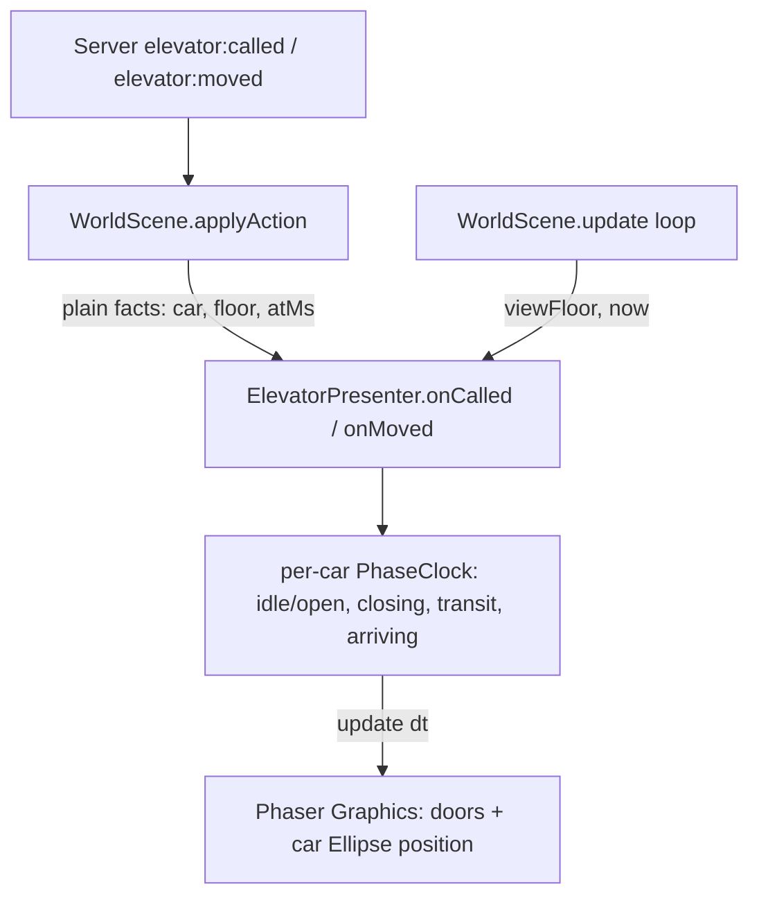

# Elevator Animation Design

**Spec**: `.specs/features/elevator-animation/spec.md`
**Status**: Approved

---

## Architecture Overview

One new client module, `ElevatorPresenter`, owns every visual for the two
cars (doors + ride motion). `WorldScene` keeps doing exactly what it does
today — dispatch protocol-shaped `MovementAction`s and hold the authoritative
`floor`/`viewFloor` facts — but instead of mutating `Ellipse.setVisible`
inline, it forwards three plain facts to the presenter: car id, car's current
floor, and the wall-clock time the fact became true. The presenter derives
door/motion state purely from those facts plus `TUNING` constants; it never
sees a `MovementAction`, a Colyseus type, or the registry.



**Approach chosen vs. alternatives considered:**

1. **(Chosen) Standalone presenter module, scene forwards plain facts.**
   Presenter has zero imports beyond Phaser + `FloorId`. WorldScene's
   `applyAction` cases for `elevator-called`/`elevator-moved` shrink to one
   line each (call the presenter) plus the existing panel update.
2. **(Rejected) Animate inline inside `WorldScene.update()`.** Cheapest to
   write, but repeats the exact coupling problem the user flagged — timing
   constants, easing, and door-state logic would live interleaved with
   protocol dispatch and player-position code, exactly what a later "change
   the animation" edit should not have to wade through.
3. **(Rejected) Drive animation off a new sim-emitted phase field.** Would
   need a new wire message/field for phase transitions client-side; rejected
   because P2/P3 of the spec is explicit — zero protocol changes, and the two
   existing events (`elevator:called`, `elevator:moved`) plus fixed `TUNING`
   durations are already sufficient to derive every phase transition a
   bystander is allowed to know (see spec Assumptions).

Chosen approach costs one new file and a ~10-line change to two existing
methods; it is the only option that satisfies the spec's ELAN-09/10/11 (P3)
requirements directly.

---

## Code Reuse Analysis

### Existing Components to Leverage

| Component | Location | How to Use |
| --- | --- | --- |
| `TUNING.ELEVATOR_ARRIVE_SECONDS` / `RIDE_SECONDS_PER_FLOOR` / `DWELL_SECONDS` | `packages/shared/src/tuning.ts` | Presenter imports `TUNING` directly (already a dependency-free shared package) — single source of truth for every animation duration, unchanged by this cycle |
| `this.cars` map (`{ ellipse, floor }` per car) | `apps/client/src/scenes/WorldScene.ts:93` | Presenter takes the `Ellipse` handle at construction; WorldScene keeps owning creation/destruction of the Ellipse (harness contract — presenter never creates/destroys Ellipses, only repositions/toggles them) |
| `carPx(car)` landing-x helper | `WorldScene.ts:317-319` | Reused as-is to compute tween target x; presenter receives it via constructor injection (a plain function), not by importing WorldScene |
| `MovementAction` cases `'elevator-called'` / `'elevator-moved'` | `WorldScene.applyAction` | Stay the dispatch entry point; each case now also forwards plain fields to the presenter (no new action types) |
| Update loop (`WorldScene.update(dt)`) | `WorldScene.ts:~380-410` | Gains one line calling `this.elevatorPresenter.tick(dt, this.viewFloor)` — presenter owns its own internal per-car clocks |

### Integration Points

| System | Integration Method |
| --- | --- |
| `WorldScene.create()` | Constructs `new ElevatorPresenter(this.add, this.cars.get(1)!.ellipse, this.cars.get(2)!.ellipse, this.carPx.bind(this))` once, alongside existing car Ellipse creation |
| `WorldScene.applyAction` | `elevator-called` → `presenter.onCalled(action.car, Date.now())`; `elevator-moved` → `presenter.onMoved(action.car, action.floor, Date.now())` (existing panel-update calls unchanged, run alongside) |
| `WorldScene.update(dt)` | One added call: `presenter.tick(dt, this.viewFloor)` — presenter reads `viewFloor` only to decide what's visible, mirroring the existing `car.floor === this.viewFloor` gate |
| Harness (`round.spec.ts`, `movement.spec.ts`, `work.spec.ts`) | Untouched — doors are drawn via `Phaser.GameObjects.Graphics` (a `Graphics` child, not `Rectangle`/`Ellipse`), so existing `type === 'Rectangle'`/`type === 'Ellipse'` counts stay exact |

---

## Components

### `ElevatorPresenter`

- **Purpose**: Own all door/motion visual state for the building's two
  elevator cars, driven only by plain facts and fixed tuning constants — no
  protocol, no Colyseus, no scene-internal state beyond what's injected.
- **Location**: `apps/client/src/scenes/elevatorPresenter.ts` (new file)
- **Interfaces**:
  - `onCalled(car: 1 | 2, atMs: number): void` — marks the car's phase-clock
    entering `arriving`, starting the fixed `ELEVATOR_ARRIVE_SECONDS` timer
  - `onMoved(car: 1 | 2, floor: FloorId, atMs: number): void` — marks a stop:
    the car is now at `floor`, doors open (`dwelling`/`idle`), starts the
    fixed `ELEVATOR_DWELL_SECONDS` close-timer
  - `tick(dtMs: number, viewFloor: FloorId): void` — advances every car's
    internal clock, updates door Graphics alpha/scale and Ellipse
    visibility/position for cars on `viewFloor` only; hides everything for
    cars not on `viewFloor` (mirrors existing gate, now centralized here)
  - `reset(): void` — called from `WorldScene.create()` on every scene
    restart (lobby→round→lobby), matching the existing `this.cars.clear()`
    reset discipline
- **Dependencies**: Phaser (`Scene.add` factory for `Graphics`), `TUNING`
  from `@turnover/shared`, `FloorId` type, and two constructor-injected
  values (car Ellipse handles, `carPx` function) — no `Colyseus`, no
  `MovementAction`, no registry types
- **Reuses**: `TUNING` constants (no new tuning values), the existing
  `carPx()` landing-x math, the existing `Ellipse` instances (repositions
  them, never re-creates them)

### Per-car `PhaseClock` (internal type, not exported)

- **Purpose**: Local state machine mirroring the sim's phase names
  (`idle-open`/`closing`/`transit`/`arriving-motion`) purely for rendering —
  intentionally NOT a 1:1 mirror of the sim's authoritative phases (the sim's
  `riding` phase duration is rider-exclusive information; see spec
  Assumptions), just enough states to drive door alpha and Ellipse
  visibility/position.
- **Location**: Same file, private to `elevatorPresenter.ts`
- **Interfaces**: internal only (`advance(dtMs)`, `doorsOpenAmount(): number`,
  `visiblePosition(): number | null`)
- **Dependencies**: none beyond `TUNING`
- **Reuses**: n/a (new, minimal)

---

## Data Models

No persistent data. Presenter-internal, ephemeral, per-scene-lifetime state:

```typescript
interface CarClock {
  /** Rendering-only phase name — distinct from the sim's phase enum; see
   *  spec Assumptions on the bystander information boundary. */
  phase: 'doors-open' | 'doors-closing' | 'in-transit' | 'arriving'
  /** ms remaining in the current phase, counted down by tick(dtMs). */
  msRemaining: number
  /** The floor this car is currently rendered at (last known via onMoved). */
  floor: FloorId
}
```

**Relationships**: One `CarClock` per car id (`1 | 2`), held in a
`Map<1 | 2, CarClock>` inside `ElevatorPresenter`. No relationship to any
persisted/server model — purely a rendering derivative of `elevator:called`
and `elevator:moved` receipt timing plus fixed `TUNING` durations.

---

## Risks & Concerns

- **Fragile-code flag**: `WorldScene.update()` is already a single 40-line
  method mixing several concerns (own-player prediction, other-player lerp,
  car visibility, panel refresh, work-bar DOM). Mitigation: this design adds
  exactly one line to that method (`presenter.tick(...)`) and moves zero
  existing lines into the presenter — it does not attempt to refactor
  `update()` beyond that, keeping this cycle's diff minimal and reviewable.
  A follow-up cycle could extract the other concerns similarly if desired;
  out of scope here.
- **Test-coverage gap**: no existing gate scenario asserts *visual* animation
  state (door alpha, tween position) — `round.spec.ts`/`movement.spec.ts`
  assert object *counts* and `floor`/`x` data fields only. Mitigation:
  Tasks phase adds `sim`-free unit coverage for `PhaseClock`/`ElevatorPresenter`
  timing logic directly (pure functions, no Phaser needed for the clock math)
  plus one new `client:elevator_doors` Playwright scenario asserting the new
  `Graphics` child appears/disappears and the Rectangle/Ellipse counts stay
  unchanged (ELAN-04 direct check).
- **Bystander-information risk**: getting the "in-transit, unknown duration"
  rendering wrong (e.g., picking a duration that leaks whether a ride is long
  or short) would violate the message-only hard rule in spirit even without a
  new wire message. Mitigation: P2 AC1 pins a fixed minimum transit duration
  independent of actual ride length — the visual never varies with the real
  (unknown-to-bystander) distance.
