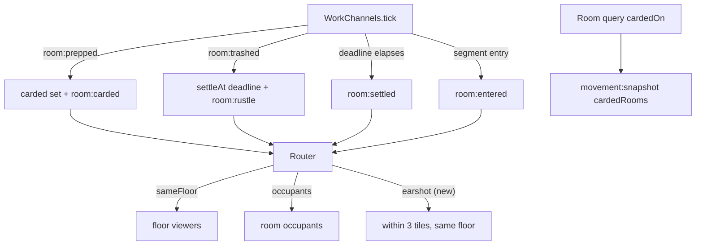

# Evidence Design (cycle 2.7)

**Spec**: `.specs/features/evidence/spec.md`
**Status**: Approved (autonomous run — agent defaults per spec assumptions table)

---

## Architecture Overview

Evidence is round-scoped state, so it lives where room states already live:
`WorkChannels` (AD-002 seam). The module already owns the two detection points the
evidence layer hangs off — state-transition completions and segment-crossing
observation — so cards, freshness, rustle, and door-open cues extend those points
instead of adding a new subsystem. Routing stays generic: one new registry row per
message, one new recipient policy (`earshot`), applied by the existing Router.



No new sim class, no new intent, no tuning change: the only constants consumed are
`TUNING.FRESHNESS_WINDOW_SECONDS` (75) and `TUNING.RUSTLE_RANGE_TILES` (3), both
already in §7.

---

## Code Reuse Analysis

### Existing Components to Leverage

| Component | Location | How to Use |
|---|---|---|
| Segment-entry detection | `packages/sim/src/work.ts:167-187` (`lastSegment` loop) | Emits `room:entered` alongside the existing `room:observed` — same key-change trigger |
| State-transition completion | `packages/sim/src/work.ts:140-165` | `room:prepped` hangs a card + cancels a settle; `room:trashed` starts a settle + emits the rustle |
| Generic Router dispatch | `apps/server/src/rooms/router.ts:97-138` | New rows/policies only; the dispatch chain extends with one more branch |
| `ViewContext` + `setViewContext` | `apps/server/src/rooms/router.ts:34-43`, `TurnoverRoom.ts:77` | Gains `x`; the room already derives contexts from `movement.viewOf` |
| Layout geometry | `packages/shared/src/layout.ts` (`roomSegmentStartMilli`/`EndMilli`) | Earshot distance = x vs the room segment's nearer edge |
| AD-017 exit snapshot | `TurnoverRoom.ts:93-108` | Extended to pass the arrival floor's carded rooms into `snapshotFor` |
| Client generic dispatcher | `apps/client/src` (AD-006 mappers) | Four new `Record<RegistryKey, Mapper>` rows; no dispatch changes |

### Integration Points

| System | Integration Method |
|---|---|
| Protocol registry | 4 new `SimEvent` variants, 4 payload interfaces, 4 registry rows, `'earshot'` joins the closed policy enum |
| `movement:snapshot` | Payload gains `cardedRooms: RoomIndex[]` (own floor only) |
| RoundSim | New read-only delegate `cardedOn(floor)` for snapshot composition |

---

## Components

### WorkChannels extensions

- **Purpose**: Own card state, freshness deadlines, and the two new cue emissions.
- **Location**: `packages/sim/src/work.ts` (existing class extended).
- **Interfaces** (new/changed):
  - `cardedOn(floor: GuestFloorId): RoomIndex[]` — snapshot query (ascending room order).
  - Internal: `carded: Set<string>` (roomKeys); `settleAt: Map<string, number>`; `elapsedTicks: number`.
- **Dependencies**: `TUNING`, `layout` helpers (already imported transitively via `roomIndexAtMilli`).
- **Reuses**: The existing tick ordering — pending starts → walk-out cancels → completions → settle check → observation. Determinism is preserved: settle checks run on absolute tick numbers, never wall time.

### Router `earshot` policy

- **Purpose**: Deliver `room:rustle` to exactly the earshot set, server-side.
- **Location**: `apps/server/src/rooms/router.ts` (new dispatch branch).
- **Interfaces**: none new — `dispatch()` gains a `recipients === 'earshot'` branch.
- **Rule**: deliver iff `vc.floor === visibility.floor && vc.x !== null && dist(vc.x, segment(room)) ≤ RUSTLE_RANGE_TILES × 1000`, where `dist` is the distance to the nearer segment edge (0 inside; inclusive at the boundary). `visibility.room` (new optional `EventVisibility` field) carries the segment index.
- **Dependencies**: `EventVisibility`, layout constants, `ViewContext.x`.
- **Reuses**: The `sameFloor` branch shape (per-client view-context match).

### ViewContext / viewOf

- **Purpose**: Give the Router the viewer's x for earshot filtering.
- **Location**: `apps/server/src/rooms/router.ts:34-41` (interface), `packages/sim/src/movement.ts:372-385` (`viewOf`).
- **Interfaces**: `ViewContext.x: number | null` — integer millitiles; null for riders and unresolved positions. `viewOf` returns `x` from the player's current position (riders → null, preserving AD-009: riders get no floor streams and no earshot).
- **Reuses**: Existing `viewOf` branches — one field added per return shape.

### movement:snapshot cards

- **Purpose**: Late/refreshed views learn the own-floor card set without event replay.
- **Location**: `packages/sim/src/movement.ts:323-370` (`snapshotForFloor`/`snapshotFor`), `TurnoverRoom.ts` callers.
- **Interfaces**: `snapshotForFloor(floor, cardedRooms?: RoomIndex[])`, `snapshotFor(playerId, cardedRooms?: RoomIndex[])` — default `[]`. `MovementSnapshot` gains `readonly cardedRooms: RoomIndex[]`.
- **Callers**: join → lobby floor, omitted; buzzer refresh → sim already dropped (cards are round-scoped, evidence dies with the round — stale cards must not outlive the sim), omitted; AD-017 door-open exit → the room passes `sim.cardedOn(arrivalFloor)`; **non-rider floors during a round have no other snapshot trigger** (interiors stay `room:observed`-driven).
- **Reuses**: The existing snapshot shapes — additive optional parameter, non-rider snapshots stay byte-identical when omitted (AD-013 precedent).

### Client evidence view

- **Purpose**: Gray-box hallway rendering of cards and cues.
- **Location**: `apps/client/src` (new `evidenceSession.ts` reducer + `WorldScene.ts` renderer), harness `evidence.spec.ts`.
- **Interfaces**: four new mapper rows; `evidenceSession` reduces `room:carded` (add room to own-floor card set — idempotent), `room:settled`/`room:trashed`-adjacent interior reads stay as today; `room:entered`/`room:rustle` push timestamped cue entries the scene drains each frame.
- **Rendering**: card glyph at the room's segment-center hallway front (own floor, all carded rooms — first floor-public room visual); door-open = brief front highlight + short oscillator beep; rustle = lower-tone beep + timed front pulse. DOM/Phaser gray-box, no art.
- **Reuses**: WorldScene's existing own-floor room rendering and the AD-006 dispatcher.

---

## Data Models

### New wire payloads (registry rows)

```typescript
export interface RoomCarded  { readonly floor: FloorId; readonly room: RoomIndex }
export interface RoomSettled { readonly floor: FloorId; readonly room: RoomIndex }
export interface RoomRustle  { readonly floor: FloorId; readonly room: RoomIndex }
export interface RoomEntered { readonly playerId: string; readonly floor: FloorId; readonly room: RoomIndex }
```

Policies: `room:carded` → `'sameFloor'`; `room:entered` → `'sameFloor'`; `room:settled`
→ `'occupants'`; `room:rustle` → `'earshot'` (new enum member). No payload carries a
timestamp, author, role, or interior state (FR-11's "no timestamp"; protocol rule 5).

### Sim events

```typescript
| { type: 'room:carded';  floor: FloorId; room: RoomIndex }
| { type: 'room:settled'; floor: FloorId; room: RoomIndex }
| { type: 'room:rustle';  floor: FloorId; room: RoomIndex }
| { type: 'room:entered'; playerId: string; floor: FloorId; room: RoomIndex }
```

### Freshness bookkeeping

```typescript
settleAt: Map<string, number>   // roomKey → absolute tick the window elapses
carded:   Set<string>           // roomKeys hung (never removed — FR-11 permanence)
elapsedTicks: number            // incremented at the top of every tick()
```

Window math (EVID-06): a trash completing during tick T sets `settleAt = T + 1500`
(`TUNING.FRESHNESS_WINDOW_SECONDS × TICK_HZ`); the settle fires in the settle-check
of the tick whose counter equals `T + 1500` — exactly 1500 ticks observable as
`'trashed'`. Prep completion deletes the deadline (EVID-09); re-trash overwrites it
(EVID-10). The settle-check runs AFTER completions so a same-tick trash can settle
in a re-trash loop's future and a same-tick prep cancels cleanly.

---

## Error Handling Strategy

| Error Scenario | Handling | User Impact |
|---|---|---|
| Fake prep completes | No transition → no card, no rustle, no settle (FR-9 indistinguishability preserved) | Hallway shows nothing |
| Carded room re-prepped | `room:carded` re-emitted (idempotent reducer) | No visible change |
| Sim dies at buzzer mid-window | Deadline dies with the sim; no post-buzzer `room:settled` (WORK-13 precedent) | Evidence resets with the round |
| Rider in a car when a rustle fires | `viewOf` → `x: null` → no delivery (AD-009) | Rider hears nothing until arrival |
| Viewer x exactly at range boundary | Inclusive comparison (`≤`) | Heard at 3.000 tiles |

---

## Risks & Concerns

| Concern | Location | Impact | Mitigation |
|---|---|---|---|
| `registry.test.ts` pins the full policy-membership map | `packages/shared/src/protocol/registry.test.ts:106-108` | New rows break the pinned map | Update the pinned map in the same task as the registry rows (test is the audit surface, not an obstacle) |
| `viewOf` return shapes are asserted `toEqual` in movement tests | `packages/sim/src/movement.test.ts:294-313` | Adding `x` breaks equality assertions | Update those assertions in the same commit; the `x` addition is part of ViewContext's contract |
| Snapshot callers multiply — a missed caller sends stale cards | `TurnoverRoom.ts:105, 188, 304` | A player keeps a wrong card picture | Cards are additive and re-emitted on every prep; the only guest-floor snapshot trigger is the AD-017 exit, which is updated in the same task; pinned by an e2e test |
| Pre-round walking emits no evidence (sim dead) | AD-002 seam | Players roaming pre-round get no cues — matches `room:observed` today | Spec assumption logged; behavior identical to the existing observation half |
| Buzzer snapshot omits cards while players may stand in rooms | `TurnoverRoom.ts:294-306` | Post-buzzer views lose card info | Accepted: the round is over, evidence is round-scoped, next deal resets all rooms (2.5 assumption "every round starts fresh") |

---

## Tech Decisions (only non-obvious ones)

| Decision | Choice | Rationale |
|---|---|---|
| Evidence state owner | Extend `WorkChannels`, not a new class | Both detection points (transitions, segment entries) already live there; a separate class would re-derive the same inputs and split the room-state truth |
| Rustle policy name | `'earshot'` | Names the acoustic concept, not the mechanism; the enum stays closed and deliberate (AD-006 rule) |
| Viewer x source | `ViewContext.x` from `movement.viewOf` | The Router never derives visibility (router.ts contract); the room already supplies contexts from the movement sim |
| Card query path | `RoundSim.cardedOn → WorkChannels.cardedOn`, passed into `snapshotFor` by the room | Keeps `MovementSim` ignorant of work state (AD-005 seam); no callback wiring inside the sim |
| Settle ordering | After completions, before observation | A same-tick prep completion cancels the window before the settle-check reads it — deterministic resolution of the prep-vs-settle race |

> Project-level decision check: the `'earshot'` policy extends the closed
> recipient-policy enum exactly as AD-008's amendment rule anticipates ("the
> registry's recipient-policy enum extends deliberately when a cycle's Design
> phase declares the position streams"). This is recorded in design, not a new
> AD — the extension follows the existing decision. Everything else conforms to
> AD-002/005/006/009/010/015.
