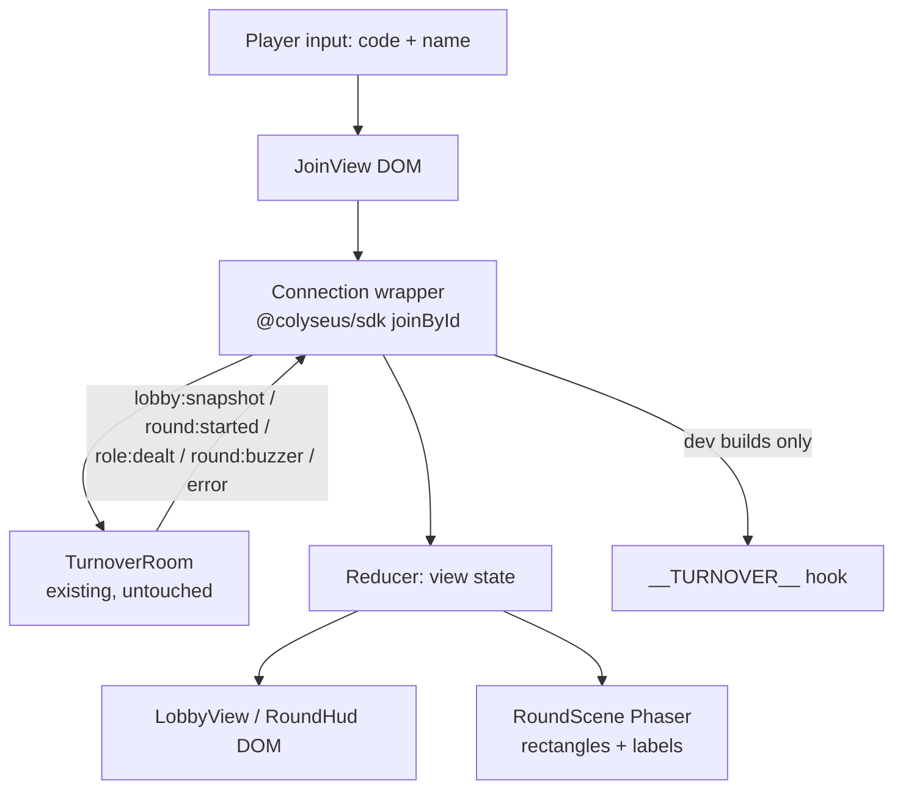

# First-Light Design

**Spec**: `.specs/features/first-light/spec.md`
**Status**: Approved

---

## Architecture Overview

The client is a thin three-view app over the existing T3 message catalog: a DOM
overlay handles the join screen, lobby, role card, clock, and error banners; a
Phaser scene renders the round-world rectangles. A small connection wrapper
translates Colyseus SDK callbacks into typed messages; a pure reducer turns
messages into view state so transitions (lobby ⇄ round, buzzer reset) are
unit-testable. No protocol changes (AD-003).

The server gets exactly one seam (AD-004): the harness boots it with
`TURNOVER_TEST_SHIFT_SECONDS=5` so a real buzzer is reachable in gate 3; the
production path keeps the §7 value and the env var is ignored in production.

---

## Code Reuse Analysis

### Existing Components to Leverage

| Component | Location | How to Use |
| --- | --- | --- |
| `#overlay` DOM root | `apps/client/index.html` | Join/lobby/role-card/clock UI mounts here |
| Debug hook | `apps/client/src/debug.ts` | Extend with `recordEvent`/`setLocal`; prod strip check (`check-prod-strip.mjs`) already gates it |
| Boot scene pattern | `apps/client/src/scenes/BootScene.ts` | Register `RoundScene` alongside; same registration style |
| Message types | `packages/shared/src/protocol/messages.ts` | Consume as-is: `LobbySnapshot`, `RoundStarted`, `RoleDealt`, `RoundBuzzer`, `IntentError` |
| Tuning | `packages/shared/src/tuning.ts` | `TUNING.SHIFT_SECONDS` drives the client countdown start |
| Playwright webServer | `apps/client/harness/playwright.config.ts` | Extend `command` with the test shift env var |
| Room name/case rules | `apps/server/src/index.ts:34-39` | Codes are uppercased on the wire; client can send either case (spec LIGHT-03 keeps the uppercase UX rule) |

### Integration Points

| System | Integration Method |
| --- | --- |
| Colyseus matchmaking | `@colyseus/sdk` `Client.joinById(code, { name })` → `POST /matchmake/joinById/<code>` (middleware already routed) |
| Room messages | `room.onMessage('lobby:snapshot' \| 'round:started' \| 'role:dealt' \| 'round:buzzer' \| 'error', cb)`; intents via `room.send('lobby:start', { type: 'lobby:start' })` |
| Sim shift length | `RoundSim` gains an optional `totalTicks` override (default `TUNING.SHIFT_SECONDS × TICK_HZ`, unchanged) |

---

## Components

### Connection wrapper

- **Purpose**: Own the Colyseus SDK session; surface typed server messages and send the start intent.
- **Location**: `apps/client/src/net/connection.ts`
- **Interfaces**:
  - `connect(code: string, name: string): Promise<Connection>` — joins by code; rejects with the server's join-rejection reason.
  - `Connection.onMessage(handler: (msg: ServerMessage) => void): void` — typed dispatch; also records into `__TURNOVER__` (dev builds only).
  - `Connection.sendStart(): void` — sends `lobby:start`.
  - `Connection.onDisconnect(cb: () => void): void`
- **Dependencies**: `@colyseus/sdk` (new dependency, `^0.18.2` — matches the server's 0.18 line; verify exact constructor/join API against 0.18 docs during implementation, see Risks).
- **Reuses**: `packages/shared` protocol types.

### View reducer

- **Purpose**: Pure transition function from messages + inputs to view state; makes buzzer/reset behavior testable without a browser.
- **Location**: `apps/client/src/state.ts`
- **Interfaces**:
  - `type ViewState = { view: 'join' \| 'lobby' \| 'round' \| 'lost'; snapshot: LobbySnapshot \| null; role: Role \| null; roundStartedAt: number \| null; error: string \| null }`
  - `reduce(state: ViewState, action: Action): ViewState` — actions: `snapshot`, `round-started(atMs)`, `role-dealt`, `buzzer`, `intent-error`, `join-failed`, `connection-lost`, `clear-error`, `submit-join`.
- **Dependencies**: shared types only.
- **Reuses**: none needed.

### DOM overlay views

- **Purpose**: Render join screen, lobby (roster + host marker + host-only start), round HUD (role card, countdown, errors), connection-lost notice; translate clicks/keypresses into actions.
- **Location**: `apps/client/src/ui/` (`joinView.ts`, `lobbyView.ts`, `roundHud.ts`, shared `dom.ts` helper)
- **Interfaces**:
  - `renderJoin(root, { error, onSubmit(code, name) })`
  - `renderLobby(root, snapshot, { onStart() })` — start control only when `isHost`
  - `renderRoundHud(root, { role, deadlineMs, error })` — countdown interval at 250 ms; clamps at 00:00
- **Dependencies**: reducer's `ViewState`; no framework (plain DOM, matching the Phase 3 overlay plan).
- **Reuses**: `#overlay` root.

### RoundScene (Phaser)

- **Purpose**: Render one labeled rectangle per player while the round view is active; static layout (no movement until 2.3).
- **Location**: `apps/client/src/scenes/RoundScene.ts`
- **Interfaces**:
  - `setPlayers(entries: { id: string; name: string }[]): void` — rebuilds rectangles; labels fall back to the raw id when a name is missing (LIGHT-12).
  - Started when the reducer enters `round`; stopped (scene sleep) at buzzer.
- **Dependencies**: Phaser 4; roster from the last snapshot.
- **Reuses**: BootScene registration pattern.

### Harness scenarios

- **Purpose**: Gate 3 evidence for `client:lobby_join` and `client:round_start`.
- **Location**: `apps/client/harness/lobby.spec.ts`, `apps/client/harness/round.spec.ts`
- **Interfaces**: Playwright specs; 4 pages in one context join the same room; assertions via `page.evaluate` on `window.__TURNOVER__` and the overlay DOM.
- **Dependencies**: existing webServer config, extended with `TURNOVER_TEST_SHIFT_SECONDS=5`.
- **Reuses**: `boot.spec.ts` evaluation pattern.

---

## Data Models

No persisted data. The reducer's `ViewState` (above) is the only client model; the roster id→name map is derived from the last `LobbySnapshot`.

---

## Error Handling Strategy

| Error Scenario | Handling | User Impact |
| --- | --- | --- |
| Join rejected (not found / full / in progress / bad name) | SDK join promise rejects with the server reason; reducer stores it; join view re-renders | Rejection text on the join screen |
| Start rejected (`need-more-players`, `round-already-active`, `not-host`) | `error` message → banner in the current view, cleared on next successful transition | Error banner, stays in lobby |
| WebSocket drops | `onLeave`/connection close → `connection-lost` | Static "connection lost" notice; no retry (FR-25 later) |
| Duplicate join submission | Join view ignores submits while a connection attempt is in flight | No double connect |
| Missing roster name for a round playerId | RoundScene labels the rectangle with the raw id | Cosmetic fallback |

---

## Risks & Concerns

| Concern | Location (file:line) | Impact | Mitigation |
| --- | --- | --- | --- |
| `@colyseus/sdk` browser API shape (constructor, `joinById` rejection semantics, message event names) is not yet exercised in this repo | new dep `apps/client/package.json` | Wrong assumptions would cascade into the connection wrapper | Implementer verifies against the 0.18 docs before writing `connection.ts`; a throwaway probe spec in the harness run confirms join + message paths first |
| `RoundSim.TOTAL_TICKS` is a static; adding an instance override touches the sim | `packages/sim/src/roundSim.ts:19` | Gate 2 regressions if the default path changes | Override is optional with the §7-derived default; all existing sim tests run unchanged (gate 2 in the same task) |
| Real buzzer needs 300 s wall time in e2e | `apps/server/src/rooms/TurnoverRoom.ts:158` | LIGHT-13/14 untestable at gate 3 | AD-004 test seam: env-overridden shift in non-production only; harness sets 5 s |
| Harness clock display vs. short test shift | `apps/client/src/ui/roundHud.ts` | In harness the DOM clock (300 s) outlives the 5 s server round — looks like a bug in evidence | Accepted: the client clock is display-only until 2.3 introduces server time fields; scenario asserts the buzzer transition, not clock agreement |

---

## Tech Decisions (only non-obvious ones)

| Decision | Choice | Rationale |
| --- | --- | --- |
| Buzzer reachable in gate 3 | `RoundSim` optional `totalTicks` + `TURNOVER_TEST_SHIFT_SECONDS` env (non-production only), harness boots server with 5 s | Real end-to-end buzzer evidence; every later Phase 2 cycle's client scenarios need fast rounds too. Production default path keeps §7 values. **Project-level — recorded as AD-004.** |
| Client SDK package | `@colyseus/sdk@^0.18.2` (the 0.18-era client; `colyseus.js` npm is stalled at 0.16) | Matches server 0.18 line; verified via npm registry 2026-08-28 |
| View logic placement | Pure reducer + dumb DOM/Phaser renderers | Buzzer/lobby transitions testable without a browser; renderers stay boring |
| Clock | Client-side `Date.now()` deadline from `round:started` receipt + `TUNING.SHIFT_SECONDS` | Spec assumption (user-confirmed); no protocol change |

---

## Excluded by Design

- No server message changes; no new server files beyond the TurnoverRoom env-seam lines.
- No reconnection, no persistence, no art/audio.
- Vite dev proxy: out of scope — the human gate-4 check runs the server-built bundle (`pnpm --filter @turnover/client build && pnpm --filter @turnover/server dev` equivalent), same origin as production.
