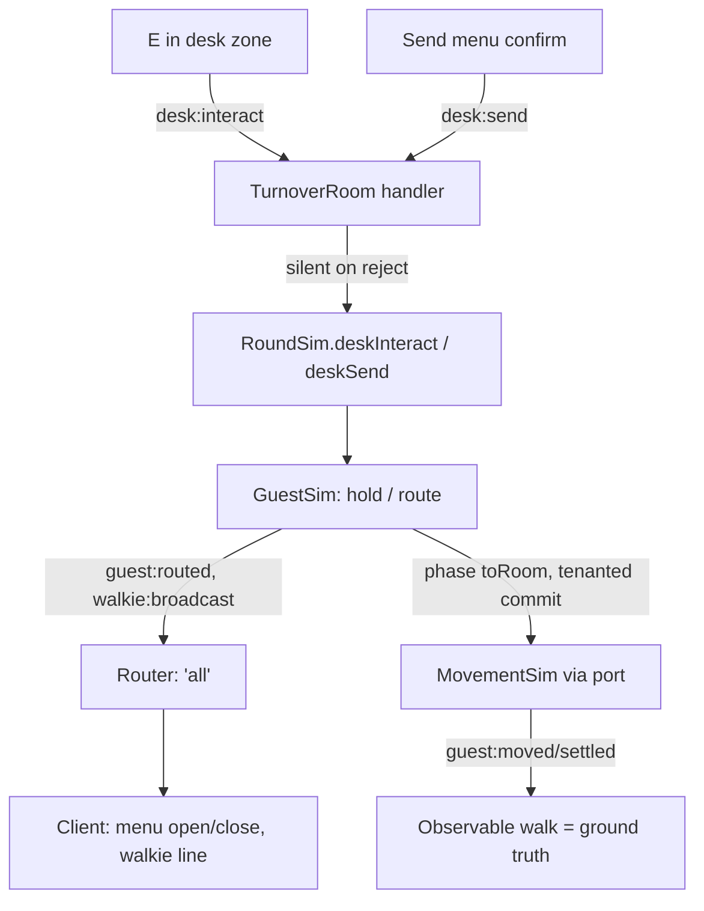

# Front Desk Design

**Spec**: `.specs/features/front-desk/spec.md`
**Status**: Approved (autonomous run — all gray areas pre-decided in the spec's assumptions table)

---

## Architecture Overview

The desk is sim-owned state in `GuestSim` (a holder map), reached through two new
`RoundSim` intent APIs exactly like `accuse`/`startWork`; the room adds two zod
intent handlers and stays silent on every rejection. Two new sim events
(`guest:routed`, `walkie:broadcast`) flow through the registry with `'all'`
policies — the destination never rides any wire payload; the guest's observable
walk (`guest:moved`/`guest:settled`, already public in 3.1) is the ground truth.



**Key decisions**

- **Hold model**: a held guest gets `phase: 'held'` + `heldBy: playerId`; they
  leave the queue array immediately (AC1) and the remaining queue does NOT
  re-place while the hold lasts (spec assumption — `removeFromQueue`'s
  re-place loop is only used on release-to-front and self-assign). Impatience
  freezes as `remaining = max(0, impatientAt − tick)`; release restores
  `impatientAt = tick + remaining` (never resets).
- **Receive/release derivation**: ONE intent (`desk:interact`) — the server
  derives receive vs release from whether the sender holds a guest (the
  `work:start` "server derives the action" pattern). E-again for a non-holder
  falls out as a no-op.
- **Route commit**: `desk:send` validates destination not in the tenanted map
  (reject `occupied` → room silent → client menu stays open) and COMMITS
  tenancy at route time (`tenanted.set`), matching 3.1's "assignment commits
  at choice time" — two routed guests can never share a room.
- **Walkie payload**: `{playerId, floor, room}` of the ANNOUNCED room, 'all'
  policy. The client renders the prd-locked text `«Name»: guest going to F:R`
  from the roster (RoundRecap precedent: ids on the wire, names client-side).
  Sim emits the event at intent time; it is queued in GuestSim and flushed on
  the next `tick()` (MOVE-10 announce pattern).
- **E context split**: inside the desk zone (own predicted lobby position
  within `DESK_RANGE_TILES` of `DESK_X_TILES`), keydown-E sends `desk:interact`
  and the accuse hold window never starts (spec decision); keyup-E does
  nothing. Outside the zone, E behaves exactly as 2.8 left it.

---

## Code Reuse Analysis

### Existing Components to Leverage

| Component | Location | How to Use |
| --- | --- | --- |
| `GuestSim` queue/impatience/tenancy machinery | `packages/sim/src/guests.ts` | Extend with hold map + route; reuse `removeFromQueue` re-place loop for release-to-front |
| `RoundSim` intent-validation pattern | `packages/sim/src/roundSim.ts` (`accuse`, `startWork`) | `deskInteract`/`deskSend` mirror it: round-active + live checks, position via `work.positionOf` |
| `MovementPort.positionOf` | `packages/sim/src/guests.ts` | GuestSim's per-tick walk-out detection reads holder positions |
| Fire/ghost/leave teardown paths | `roundSim.ts` (`drainPending`, `ghost`, `leave`) | Add "release all holds of this player" at each |
| Registry + projections + mappers | `packages/shared/src/protocol/*`, `apps/client/src/net/mappers.ts` | Two new rows; registry exhaustiveness forces the client mapper |
| zod intent handlers | `apps/server/src/rooms/TurnoverRoom.ts` | Two new `onMessage` blocks, silent rejection |
| DOM guest layer pattern (`#desk-bell`) | `apps/client/src/scenes/WorldScene.ts` (`buildGuestLayer`) | `#desk-hint`, `#desk-menu`, `#walkie-log` siblings |
| Contextual-E + prediction | `WorldScene.ts` (`beginAccuseHold`, `players` map) | Desk-zone branch keyed off own predicted position |
| Gate-2/3 scenario shapes | `guests.test.ts`, `apps/client/harness/guestFlow.spec.ts` | New scenarios copy the four-player-round + seeded-sim patterns |

### Integration Points

| System | Integration Method |
| --- | --- |
| Protocol registry | `guest:routed` + `walkie:broadcast` rows ('all'); sim-event exhaustiveness makes omissions a compile error |
| Movement layer | routed guest reuses the 3.1 `toRoom` driver unchanged (elevator citizen) |
| HUD | walkie log as a DOM line building-wide; desk hint/menu as DOM overlays |

---

## Components

### Shared: tuning + protocol

- **Purpose**: `DESK_RANGE_TILES = 1` (AD-031), two messages, two sim events, two intents.
- **Location**: `packages/shared/src/tuning.ts`, `protocol/{messages,simEvents,registry,intents}.ts`.
- **Interfaces**:
  - `GuestRouted { guestId, playerId }`, `WalkieBroadcast { playerId, floor: GuestFloorId, room: RoomIndex }`
  - `deskInteractIntentSchema { type: 'desk:interact' }`, `deskSendIntentSchema { type: 'desk:send', destinationFloor, destinationRoom, announceFloor, announceRoom }`
- **Reuses**: registry `Entry` rows, `GUEST_FLOOR_ENUM`.

### Sim: `GuestSim` hold/route + `RoundSim` desk APIs

- **Purpose**: receive (hold), release (E/walk-out/fired/ghosted/disconnect), route (send + claim).
- **Location**: `packages/sim/src/guests.ts`, `packages/sim/src/roundSim.ts`.
- **Interfaces**:
  - `receiveAtDesk(holderId, tick): 'accepted' | 'ignored'` — front queued guest → held; impatience frozen; no queue re-place.
  - `releaseHeld(holderId, tick): void` — unshift to queue front, re-place all slots, resume impatience.
  - `releaseAll(holderId, tick): void` — teardown wrapper (fired/ghosted/disconnect).
  - `routeHeld(holderId, dest, announce): 'routed' | 'ignored'` — commit tenancy, phase `toRoom`, queue `guest:routed` + `walkie:broadcast` for next-tick flush.
  - `RoundSim.deskInteract(playerId): 'accepted' | 'rejected'` — round-active, live, lobby floor, `|x − DESK_X| ≤ DESK_RANGE_TILES` (via `work.positionOf`), then receive-or-release.
  - `RoundSim.deskSend(playerId, dest, announce): 'routed' | 'rejected'` — round-active, live, holding, destination not tenanted.
- **Dependencies**: `MovementPort`, `TUNING.DESK_RANGE_TILES`.
- **Reuses**: queue array, `slotX`, impatience ticks, `toRoom` driver (unchanged).

Per-tick walk-out check (in `GuestSim.tick`): for each held guest, holder
position via `port.positionOf(holderId)` — `undefined`, non-lobby floor, or
outside the range releases (covers fired/ghosted teardown where the slot is
gone, plus the room's own `releaseAll` belt-and-braces).

### Server: intent handlers

- **Purpose**: zod-validate `desk:interact`/`desk:send`; map every rejection to silence.
- **Location**: `apps/server/src/rooms/TurnoverRoom.ts`.
- **Reuses**: `ensureLive`, phase guard, existing handler shape. No new error
  codes (AC2/AC9: silent); `onLeave`/`expireSeat` need no change — `sim.leave`
  and `ghost` release holds internally.

### Client: desk slice + walkie log

- **Purpose**: receive hint, two-step send menu, building-wide walkie line.
- **Location**: `apps/client/src/scenes/WorldScene.ts` (+ `ui/dom.ts` helpers), `net/mappers.ts`, `state.ts` (ViewAction union).
- **Interfaces**:
  - `guest-routed` action: own playerId → open `#desk-menu` (else ignore); also clears any queued "waiting for routed" state.
  - `walkie-broadcast` action: append `«Name»: guest going to F:R` to `#walkie-log` (rosterNames; keep last 5).
  - E keydown: desk-zone branch → `desk:interact`; accuse hold suppressed.
  - Menu: destination list (24 rooms) → announce list (24 rooms) → confirm sends `desk:send`; stays open until `guest-routed` (own) or release (own E-again in zone / own walk-out detected client-side from predicted position).
  - `#desk-hint`: own in zone AND ≥1 guest marker on the lobby floor near the desk.
- **Reuses**: `buildGuestLayer` DOM pattern, `guests` map (lobby queue count), roster names.

---

## Data Models

```typescript
// guests.ts additions
interface Guest {
  // ...existing
  heldBy: string | null          // non-null ⇔ phase 'held'
}
// GuestSim gains:
private readonly held = new Map<string, string>() // holderId → guestId
private pending: SimEvent[] = []                  // intent-time events, flushed next tick
```

**Relationships**: `held` values ⊆ `guests` keys; a routed guest transitions
`held → toRoom` with tenancy committed in the same call; the queue array never
contains a held guest.

---

## Error Handling Strategy

| Error Scenario | Handling | User Impact |
| --- | --- | --- |
| E in zone, queue empty / all held | `receiveAtDesk` → `'ignored'`; room silent | Nothing happens (AC2) |
| E-again by a non-holder | `deskInteract` receive branch → ignored | Silent (edge: first-intent-wins falls out of sequential handler dispatch) |
| Holder walks out / rides away | per-tick position check → release | Guest re-queues; impatience resumes |
| Holder fired / ghosted / disconnects | `releaseAll` in `drainPending`/`ghost`/`leave` | Guest re-queues (AC5) |
| Send to a tenanted room | `routeHeld` → `'ignored'`; room silent | Menu stays open, guest kept (AC9) |
| Send by a non-holder / out of zone / lobby phase | `deskSend` → `'rejected'`; silent | Nothing happens |

---

## Risks & Concerns

| Concern | Location | Impact | Mitigation |
| --- | --- | --- | --- |
| `GuestSim.tick` iterates a growing Map each tick — hold checks add per-tick work | `packages/sim/src/guests.ts` | Negligible (≤ dozens of guests) | Held map is tiny; positionOf is O(1) |
| Walk-out check reads holder positions via the port while the room tears fired slots down mid-tick | `roundSim.ts` teardown order | A released guest could re-queue one tick late | Teardown `releaseAll` is synchronous and authoritative; the tick check is only for walking out |
| Client menu can desync from server hold state (optimistic close) | `WorldScene.ts` | Menu open with no held guest | Menu is pure DOM with no authority; E-in-zone re-open only after a fresh receive; buzzer/round-end closes it |
| Ambient guest traffic may flake gate-3 desk scenarios (guest arrives late) | `apps/client/harness/` | Flaky waits | Drive with `TURNOVER_TEST_GUEST_SCALE` (already 0.1 in the harness) and wait on `guest:arrived` events, not wall time |

---

## Tech Decisions (non-obvious)

| Decision | Choice | Rationale |
| --- | --- | --- |
| Receive/release intent | single `desk:interact`, server derives | Matches `work:start` derivation pattern; one E key, no client state authority |
| Tenancy commit point | at route (send) time, not settle time | Mirrors 3.1 self-assign; makes AC9's "currently tenanted" predicate exact and race-free |
| Walkie name resolution | client-side from roster | Wire carries ids (RoundRecap precedent); sim has no names |
| Event flush timing | intent-time queue → next-tick flush | MOVE-10 announce pattern; keeps `tick()` the only event emitter |
| Destination validity check | `tenanted` map only (in-flight routed rooms included) | Two guests in one room is physical nonsense even mid-walk |

**AD-031 to record at design close**: `TUNING.DESK_RANGE_TILES = 1` — the
E receive/release zone at the desk. (The spec's "AD-029" placeholder number
was taken by the Deco Noir merge; the desk-range decision lands as AD-031 (AD-030 was taken by the 960x576 viewport merge),
per the AD-029 renumber precedent.)
