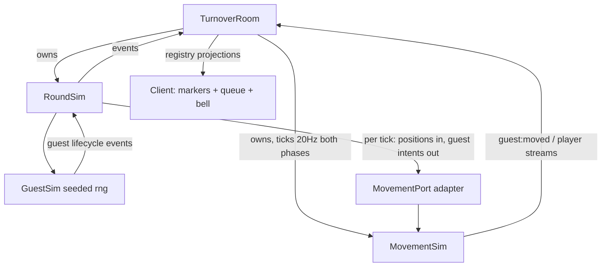

# Guest Flow Design

**Spec**: `.specs/features/guest-flow/spec.md`
**Status**: Approved (user authorized autonomous run to cycle end, 2026-08-30)

---

## Architecture Overview

Guests are a new round-scoped subsystem inside `RoundSim` (`GuestSim`), seeded from
the round seed, that drives NPC movement through the room-owned `MovementSim` via a
narrow **intent port** — the same read-and-command seam players already use, except
guest intents are generated by the sim instead of the network. `MovementSim` gains a
mover **kind** (`'player' | 'guest'`): both kinds share the entire walking/elevator
machinery (AD-023/025/026/027 semantics for free); only the event surface differs
(`player:moved` vs a new public `guest:moved`, both `sameFloor`).



**Alternatives considered** (same scope):

| Approach | Verdict |
| --- | --- |
| **A. Guests as second-class movers inside `MovementSim` (chosen)** | Reuses every elevator/walk/door rule AD-014…027 pinned; guests inherit door stages, capacity, pinned calls; one geometry source |
| B. GuestSim implements its own walking + elevator | Duplicates the most-amended code in the repo; drifts on the next elevator AD |
| C. Guests as pseudo-players (reuse `player:moved` streams) | Pollutes player snapshots, justice testimony, and recap rows; role-adjacent leaks in reverse (NPCs masquerading as players) |

This extends AD-005's read-only seam into read-and-command **for NPC movers only**
— recorded as AD-028 (project-level: guest architecture + §7-external constants).

## Code Reuse Analysis

### Existing Components to Leverage

| Component | Location | How to Use |
| --- | --- | --- |
| `MovementSim` | `packages/sim/src/movement.ts` | Mover-kind split; guests share walk/call/press/door machinery unchanged |
| Work channels state map | `packages/sim/src/work.ts` | `trashed` state + new `origin` side-map for the settled mark |
| Room geometry + room-at predicate | `packages/shared/src/layout.ts` (AD-010) | Guest targets resolve room segment → door x via the existing predicate |
| Registry + Router | `packages/shared/src/protocol/registry.ts`, `apps/server/src/rooms/router.ts` | New messages declared once; `sameFloor` policy reused for `guest:moved` |
| Rider payload policy | `packages/shared/src/protocol/registry.ts` (`elevator:riders`, AD-013) | Payload gains a `guests` array; capacity counts guests |
| Client view plumbing | `apps/client/src/net/mappers.ts`, `src/state.ts`, `WorldScene.ts` | Guest markers follow the `player:moved` marker pattern; queue/bell are DOM |

### Integration Points

| System | Integration Method |
| --- | --- |
| `RoundSim.tick(positions, …)` | Gains `intentsOut: MovementIntent[]` (guest intents the room applies to `MovementSim` before the next tick — MOVE-10 flush pattern) |
| `TurnoverRoom` | Applies guest intents each tick; purges `guest:*` movers from `MovementSim` at round end (guests are round-scoped, movement is not) |
| Round end (buzzer/abort/conviction) | `RoundSim` dies; guest events cease; room purge removes movers — no results/lobby guests (GUEST-11) |

---

## Components

### GuestSim

- **Purpose**: Owns the guest lifecycle state machine (arrival schedule → queue →
  impatience → self-assign → drive-to-room → settle → checkout) and emits guest
  lifecycle events.
- **Location**: `packages/sim/src/guests.ts`
- **Interfaces**:
  - `constructor(seed: number, playerCount: 4 | 5 | 6, vacantRooms(): RoomRef[])` —
    schedule + rng bound at construction
  - `tick(ctx: GuestTickContext): void` — `ctx` exposes `tick`, `positions` (guest
    movers), `vacantRooms()`, `tenanted(room)`, and `emit(evt)`; internally drives
    the guest **driver** (below), appending `MovementIntent`s
  - `onIntent(intent: MovementIntent): void` — collected per tick, returned to the
    room via the RoundSim tick return
- **Dependencies**: seeded `Rng` (`packages/sim/src/rng.ts`), TUNING rows, layout
  predicate
- **Reuses**: `roomAt`/segment-center geometry from `packages/shared/src/layout.ts`

### Guest driver (pure function inside `guests.ts`)

- **Purpose**: Maps a guest's goal (be at room R's door / be at the desk) to at most
  one movement intent per tick, reading the guest's `viewOf` (floor, x, car, door
  state) — the NPC counterpart of the client's input mapping.
- **Interfaces**: `driveGuest(state, view): MovementIntent | null`
- **Rules** (all inherited, not re-implemented): at a landing with a car
  open/parked there → `call` (that press BOARDS, AD-025); otherwise `call` summons
  or joins the pinned queue (AD-023); riding → `press(target)` once; doors fully
  open at target floor → walk off toward the door x; walking →
  `start/stopMove` toward the goal x. Guests never enter rooms of a floor they are
  not on; on reaching the door x, GuestSim marks the transition (`settled` /
  hotel-exit) and removes/re-adds the mover.

### MovementSim extensions

- **Purpose**: Host guest movers with identical physics; separate event surface.
- **Location**: `packages/sim/src/movement.ts`
- **Interfaces**:
  - `join(id, opts?: { floor?: FloorId; xMilli?: number })` — optional deterministic
    spawn placement (desk slots; re-entry at a room door on checkout)
  - `kindOf(id): 'player' | 'guest'` — set by a `join(id, { kind })` arg
  - Dirty-flush emits `{ kind: 'guest-moved'; guestId; floor; x }` movement events
    for guest movers (players unchanged); `snapshotFor`/`viewOf` gain `guests` for
    rider payloads
  - Capacity counting includes guests (a car with 1 player + 1 guest is full)
- **Dependencies**: none new
- **Reuses**: everything — walk, doors (AD-026/027), pinned calls (AD-023),
  press-as-board (AD-025)

### Work channels — settled origin

- **Purpose**: Checkout churn re-trashes with an author mark.
- **Location**: `packages/sim/src/work.ts`
- **Interfaces**: `trash(origin: 'sabotage' | 'churn')` — side map
  `origins: Map<roomKey, 'sabotage' | 'churn'>`; `stateOf` unchanged; display
  deferred to 3.4
- **Reuses**: existing `trash()` path and room-state map

> **Amendment (Execute, T3)**: the four-state room model already expresses the
> spawn half of FR-32 — churn is `churnTrash(floor, room)` setting the existing
> `settled` state (aged trash, no freshness window, no rustle, NO
> sabotage-shaped `room:trashed` event: grace/walk-in logic keys off it,
> JUST-07/08). No origin side-map exists; the author dimension remains 3.4
> scope. Simpler and reuses the locked state machine.

### Seeded RNG

- **Purpose**: Deterministic sampling for dwell + self-assign choice.
- **Location**: `packages/sim/src/rng.ts` (mulberry32; seed = round seed; guests
  draw from a dedicated stream so later consumers don't shift the sequence)
- **Reuses**: none (first RNG in the sim; AD-022 trade-off 5 forbids `Math.random`)

### Protocol additions (registry-first, AD-006)

| Message | Payload | Recipients |
| --- | --- | --- |
| `guest:arrived` | `{ guestId }` | `'all'` |
| `guest:impatient` | `{ guestId }` | `'all'` |
| `guest:self_assigned` | `{ guestId, floor, room }` | `'all'` |
| `guest:settled` | `{ guestId, floor, room }` | `'all'` |
| `guest:checked_out` | `{ guestId, floor, room }` | `'all'` |
| `guest:left` | `{ guestId }` | `'all'` |
| `guest:moved` | `{ guestId, floor, x }` | `'sameFloor'` (AD-009 machinery) |
| `elevator:riders` (amended) | `{ car, riders, guests, queue }` | `'riders'` (unchanged) |

`guest:self_assigned` announces the room — guests are public NPCs and their target
is the checkable claim the whole economy stands on (FR-27/FR-33 depend on it); no
hidden-state rule touches it.

### Client slice

- **Purpose**: Guest markers, desk queue, impatience cue.
- **Location**: `apps/client/src/state.ts` (guests map), `net/mappers.ts`
  (exhaustive registry additions), `scenes/WorldScene.ts` (guest markers —
  distinct color/shape, one per guest, own-floor only; queue slots rendered at
  the desk offsets), `ui/lobbyView.ts` + `ui/roundHud.ts` (`#desk-bell` line)
- **Reuses**: the `player:moved` marker pipeline and DOM-over-canvas pattern
  (AD-018); foot-tap = simple marker bounce while `impatient` until
  `self_assigned`/`settled`

---

## Data Models

### GuestState

```typescript
interface GuestState {
  readonly id: string            // `guest:<n>`, n = arrival ordinal from 1
  phase: 'queued' | 'impatient' | 'toRoom' | 'settling' | 'toExit'
  assigned: { floor: GuestFloorId; room: RoomIndex } | null
  impatientSinceTick: number | null
  dwellTicks: number              // seeded uniform 45–90s at settle time
}
```

**Relationships**: tenancy lives on the room side (`tenantedRoom: Map<roomKey,
guestId>` in GuestSim — the single vacancy source); trash origin lives in
`WorkSim.origins`.

## Error Handling Strategy

| Error Scenario | Handling | User Impact |
| --- | --- | --- |
| No vacant room at arrival-due | Arrival held (not spawned); FIFO release one/tick when vacancy returns (GUEST-02) | None at §7 dials — unreachable safety net |
| Guest's call rejected/ignored by elevator | Driver re-issues next tick; `'ignored'` is the AD-019 duplicate flash (visible, correct) | Occasional panel flash — same as players |
| Buzzer mid-walk/mid-ride/mid-dwell | Round dies; room purges guest movers; no checkout trash (GUEST-11) | Guests vanish at results — accepted staging |
| Guest at desk when a *later* guest's hold releases | FIFO queue order preserved; slots recomputed deterministically | Queue shuffles forward |

## Risks & Concerns

| Concern | Location | Impact | Mitigation |
| ------- | -------- | ------ | ---------- |
| `movement.ts` is the most-amended file (AD-012…027) — mover-kind split touches its core | `packages/sim/src/movement.ts` | Regression in elevator semantics | Split is type-additive (default `'player'` keeps every existing path byte-identical); the 323-test suite + new replay pin (GUEST-14) guard it |
| Guest intents widen the AD-005 seam (sim → movement writes) | `packages/sim/src/roundSim.ts` | Architectural drift | Port is narrow (6 methods), NPC-only, recorded as AD-028; players' intents still enter only via the network |
| `movement.ts:748` snapshot paths assume players | `snapshotFor`/`snapshotForFloor` | Guest leakage into player snapshots or vice versa | Rider payload gains `guests` explicitly; non-rider snapshots asserted byte-identical in tests |
| Queue-slot teleporting is non-physical | GuestSim queue slots | Visual pop when queue shifts | Accepted (gray-box); client may tween — art workstream owns polish |

## Tech Decisions (feature-local)

| Decision | Choice | Rationale |
| --- | --- | --- |
| Guest ids | `guest:<ordinal>` strings in the same id space as players | MovementSim is id-keyed; namespacing makes purge/trivial |
| Arrival schedule | Fixed interval, no jitter, no rng draw | §7 specifies a cadence; fewer rng draws = stabler replay |
| RNG stream isolation | Guests draw from their own mulberry32 stream seeded from the round seed | Later rng consumers (3.2 routing, 3.3 complaints) won't shift guest sequences |
| Queue direction | Slots extend eastward (x increasing) from the desk | Deterministic; no gameplay meaning |
| Desk/queue constants | `DESK_X_TILES = 15`, `GUEST_QUEUE_SPACING_TILES = 1` → AD-028 | §7-external constants need a recorded AD (AD-007 precedent) |

**Project-level (→ STATE.md as AD-028)**: guests are round-scoped sim-owned NPCs
driving the room's movement layer through an NPC-only intent port (amends AD-005's
read-only seam); mover-kind split in `MovementSim`; new constants `DESK_X_TILES`,
`GUEST_QUEUE_SPACING_TILES`.
