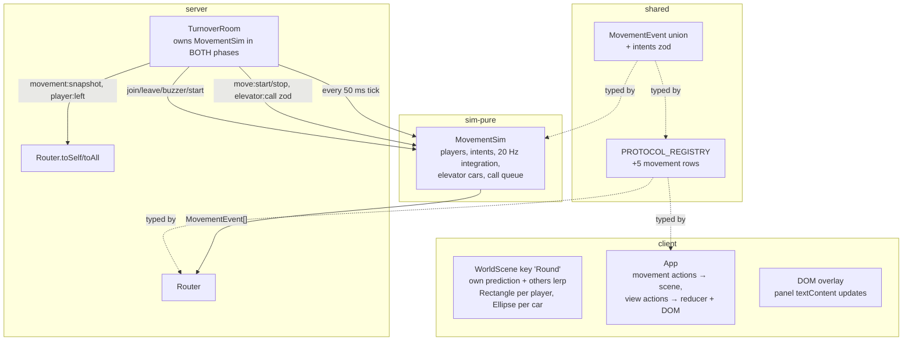

# Movement Design

**Spec**: `.specs/features/movement/spec.md`
**Status**: Approved (approach locked by AD-005 + AD-006; spec assumptions table
user-confirmed/flagged defaults)

---

## Approach

Two viable splits existed for the movement layer; AD-005 already chooses between
them at the project level:

| Approach | Verdict | Reason |
| --- | --- | --- |
| **A (chosen)**: pure `MovementSim` in `packages/sim`, owned and ticked by the room in BOTH phases; `RoundSim` untouched | ✅ | AD-005 amends AD-002 exactly this way; keeps the sim pure (gate 2 `sim:motion`/`sim:elevator` run against it directly); RoundSim stays round-scoped |
| B: fold movement into `RoundSim` | ❌ | Violates AD-005 (movement runs pre-round, RoundSim doesn't exist until host start) |

Client rendering:

| Approach | Verdict | Reason |
| --- | --- | --- |
| **A (chosen)**: continuous positions are scene-local display state in a persistent Phaser `WorldScene`; reducer stays the view-transition machine | ✅ | 20 Hz × 6 players must not churn the DOM reducer (render is full `replaceChildren`); spec keeps local prediction + lerp, which is scene state by nature |
| B: positions in `ViewState`, reducer updated at 20 Hz | ❌ | 20 Hz DOM re-renders; prediction/reconciliation is render logic, not view logic |

---

## Architecture Overview



### Data-flow split (the load-bearing decision)

- **View transitions** (join/lobby/round/lost, role, errors, snapshots) →
  `MAPPERS` → `ViewAction` → reducer → DOM re-render. Unchanged from 2.3.
- **Continuous movement** (`player:moved`, `elevator:called`, `elevator:moved`)
  maps to actions the **App routes to the WorldScene** (`scene.applyServerEvents`),
  which is display state at 20 Hz — the reducer returns the same state for these
  actions (documented no-op: positions are render state, not view state).
- `movement:snapshot` (join, buzzer) IS view-relevant (initial render) and also
  seeds the scene.

---

## Code Reuse Analysis

### Existing Components to Leverage

| Component | Location | How to Use |
| --- | --- | --- |
| Registry + Router + envelope | `packages/shared/src/protocol/registry.ts`, `apps/server/src/rooms/router.ts` | All 5 new types declared there; `Entry<K>`/`SimProjection<K>` extended over the combined sim-event union; Router untouched |
| Round harness idioms | `apps/server/src/rooms/TurnoverRoom.test.ts` (`roomWithFour`, `collectAll`) | Server-side new-type tests |
| `sim:` test style | `packages/sim/src/roundSim.test.ts` | Scripted-intent scenario format |
| Harness helpers | `apps/client/harness/*.spec.ts` | `join`/`createRoom`, `__TURNOVER__.scene('Round')` reads |
| Tick constants | `packages/sim/src/tick.ts` (`TICK_HZ`), `TUNING` | All durations derived from §7 values — no new wall-clock numbers |

### Integration Points

| System | Integration Method |
| --- | --- |
| `setSimulationInterval` | `advance()` now ticks MovementSim every interval (both phases); RoundSim only in round phase |
| Registry exhaustiveness | `satisfies { [K in RegistryKey]: Entry<K> } & { [K in SimEvent['type'] \| MovementEvent['type']]: unknown }` — an undeclared movement event fails compilation exactly like a sim event |
| LIGHT-09 harness contract | `WorldScene` keeps scene key `'Round'`; renders exactly one `Rectangle` per player (harness counts these) and `Ellipse`s for cars; all other visuals (hall, panel) are DOM — so `client:round_start` passes unmodified |

---

## Components

### MovementSim — `packages/sim/src/movement.ts` (new, pure)

- **Purpose**: The always-running spatial substrate: player positions, intents,
  20 Hz integration, confinement phases, and the two elevator cars.
- **Interface** (inputs + time in, events out — no I/O, no clocks):
  - `new MovementSim()` — starts in `lobby` phase, empty roster, both cars idle at `lobby` (car 1 west x=0, car 2 east x=HALL_LENGTH_TILES)
  - `join(playerId: string): void` — place at lobby center facing right (fresh joiner placement = FR-2 "spawn")
  - `leave(playerId: string): void` — remove (mid-round: rectangle disappears; car riders: removed from car)
  - `startMove(playerId, dir: 'left' | 'right')` — idempotent; ignored in lobby phase if the player's floor ≠ `lobby` (MOVE-08) or if in a car (MOVE-09); sets facing immediately
  - `stopMove(playerId)` — no-op if not moving
  - `callElevator(playerId, target: FloorId): 'dispatched' | 'ignored' | 'rejected'` —
    `'rejected'` when in lobby phase (the room maps this to the `elevator-locked`
    intent error) or the caller is in a car; `'ignored'` is the decoy path
    (MOVE-12); `'dispatched'` covers immediate dispatch AND queuing. The
    `elevator:called` flash announces on the **next tick** after acceptance,
    naming the serving car (decoys name the targeting car); queued calls flash
    at dispatch time, not at call
  - `unlock() / lock()` — room start / buzzer transitions; **no position changes**
    (MOVE-07, MOVE-08: positions persist; lobby phase re-confines *future*
    movement to the `lobby` floor). `lock()` additionally **clears the call
    FIFO**: elevators idle in lobby phase, so a queued dispatch would contradict
    the rejection of fresh lobby-phase calls. In-flight trips still complete
  - `tick(): readonly MovementEvent[]` — one 0.05 s step; integrates moving players, advances cars, emits events; idle ticks emit `[]`
  - `snapshot(): MovementSnapshot` — current public movement state (MOVE-18)
  - `positionOf(playerId)` — room reads for later cycles (AD-005 seam)
- **Determinism**: positions are **integer millitiles** (x × 1000). Per-tick dx = `PLAYER_SPEED_TILES_PER_SEC × 1000 / TICK_HZ` = 300 exactly — bit-for-bit replay (spec success criterion). Wire x = `xMillis / 1000` (e.g. `12.3`).
- **Events emitted**: `player:moved` when a player's x, floor, or facing changed
  this tick, plus ONE terminal event on the tick after a move intent ends
  (carries the authoritative rest x so the moving client reconciles prediction
  overshoot — post-Execute fix; amends MOVE-03's letter: an intent-ending tick
  emits even without a position change, truly idle ticks still emit nothing);
  `elevator:called` for immediate dispatches and decoys (announced
  the tick after acceptance; queued calls announce at dispatch); `elevator:moved`
  whenever a car's floor changes.

### Elevator model (inside `movement.ts`, pure — one file, one concept pair)

- **Levels**: `FLOOR_IDS` = lobby, floor1..3 (4 levels). Landings: car 1 at x=0, car 2 at x=`HALL_LENGTH_TILES` — same on every level.
- **Car state machine**: `idle(floor)` → `arriving(ticksLeft = ELEVATOR_ARRIVE_SECONDS×TICK_HZ = 60, pickup, target)` → board (instant, same tick) → `riding(ticksLeft = |pickup−target| × RIDE_SECONDS_PER_FLOOR×TICK_HZ = 40/floor, target)` → `idle(target)`. Arrival is a fixed 60 ticks from call regardless of distance — prd FR-5's abstraction, locked by MOVE-11.
- **Boarding** (MOVE-13): on the arrival tick, candidates = connected players whose floor == pickup and |x − car landing x| ≤ `ELEVATOR_LANDING_TILES` (new tuning, AD-007: 1 tile); sorted by (distance to car x, then playerId); first `ELEVATOR_CAPACITY` (2) board, rest wait for the next arrival. Boarded players: floor tracks the car (player:moved per floor hop), x pinned to the car's landing x, move intents ignored. Riders keep riding to `target` even if the caller walked away (the trip completes — decoy rides exist).
- **Dispatch** (MOVE-10): only **idle** cars are dispatched — with the fixed 3 s
  arrival, all idle cars tie, so the tie rule (car 1, west) decides; car 2
  serves whenever car 1 is busy. A call whose **target** equals a car's current
  pending target is ignored for dispatch (decoy — MOVE-12) but still flashes.
  If no car is idle, the call waits in a sim-level FIFO and is served **in FIFO
  order** by the next car to go idle. A car never holds two destinations
  (MOVE-15). `elevator:called` announces on the next tick after acceptance —
  for immediate dispatches and decoys; queued calls announce when dispatched.
- **In lobby phase**: ~~calls rejected with an intent error, no event, no flash (edge case).~~ **Superseded by AD-011**: the FIFO is no longer cleared at `lock()` and calls dispatch in both phases; see `.specs/features/elevator-lobby/`.

### Registry extensions — `packages/shared/src/protocol/`

- **`simEvents.ts`**: gains `MovementEvent` union next to `SimEvent`:
  `{ type: 'player:moved'; playerId; floor; x; facing } | { type: 'elevator:called'; floor; car } | { type: 'elevator:moved'; car; floor }`.
- **`messages.ts` payloads**: `PlayerMoved`, `ElevatorCalled`, `ElevatorMoved` (+ `PlayerLeft`, `MovementSnapshot`); `FloorId = (typeof FLOOR_IDS)[number]`, `Facing = 'left' | 'right'`, `CarId = 1 | 2`.
- **`intents.ts`** (new): zod schemas `moveStartIntentSchema` (`move:start {dir}`), `moveStopIntentSchema`, `elevatorCallIntentSchema` (`elevator:call {target}`) — strict, same pattern as `lobbyStartIntentSchema`. Intents stay outside the registry.
- **`registry.ts`**: `Payloads` + 5 rows; satisfies extended to
  `& { [K in SimEvent['type'] | MovementEvent['type']]: unknown }`;
  `Entry<K>`'s `fromSim` conditional widened to the combined union. Recipients: all
  five new rows are `'all'` except `movement:snapshot` (`'self'`). No new
  `RecipientPolicy` variants this cycle — reconciled with AD-008 post-Execute
  (verifier Gap 1 ruling): 2.4 ships global broadcasts, and live players see
  their current floor only via the WorldScene view filter (renders the local
  player's floor — AD-008's client-visible outcome). AD-008's **server-side**
  per-recipient routing (`sameFloor`/`spectators`) is deferred to the first
  cycle that must hide positions on the wire (room interiors / evidence); until
  then a modded client could read cross-floor positions — accepted and recorded
  in AD-008's amended Scope.

### TurnoverRoom wiring — `apps/server/src/rooms/TurnoverRoom.ts` (edited)

- `movement = new MovementSim()` in `onCreate` (persists across phases — AD-005).
- `onJoin`: `movement.join` + `router.toSelf('movement:snapshot', …)` alongside the lobby snapshot. Mid-round joins still rejected (no snapshot for them).
- `onLeave`: `movement.leave` + `router.toAll('player:left', { playerId })`.
- Intents: `onMessage('move:start'|'move:stop'|'elevator:call', zod, …)` → sim calls; `elevator:call` in lobby phase → `router.toSelf('error', …)` rejection.
- `advance()`: `movement.tick()` every interval (both phases), round sim only in round; all events → `router.route`. `startRound()` → `movement.unlock()`; buzzer → `movement.lock()` + fresh `movement:snapshot` to every connection.
- `RoundSim` unchanged this cycle — it consumes no positions yet; the seam is `movement.positionOf(playerId)` when 2.5 work channels need it (AD-005).

### Client — `apps/client/src/scenes/WorldScene.ts` (new; replaces `RoundScene`, keeps scene key `'Round'`)

- **Purpose**: The persistent world: one `Rectangle` (90×130, labeled) per connected player, one `Ellipse` per elevator car, hall/floor/panel visuals in DOM. Rendered from join (pre-round lobby walking) through buzzer — never torn down between phases.
- **Rendering contract (LIGHT-09 preservation)**: scene children are exactly the player `Rectangle`s (+labels) and car `Ellipse`s — nothing else. `client:round_start` passes unmodified.
- **Floor view**: renders the local player's current floor only (30-tile hall line; x scaled to canvas). Riding switches the view floor with the car.
- **Input**: cursor keys. Keydown left/right → `connection.sendMoveStart(dir)` + local prediction (own x integrates at the same speed, clamped); keyup → `sendMoveStop` + halt. Server events for self reconcile (`x` adopted, prediction continues); others set/lerp toward the event position (≤2 ticks).
- **API**: `applyServerEvents(events)` — called by App for movement-kind actions; `setPlayers(roster)`, `setSnapshot(movement)` at join.
- **Elevator panel**: DOM (`#elevator-panel`, roundHud/lobbyView scope) updated via surgical `textContent` writes from `applyServerEvents` — never occupant ids (MOVE-17); scene emits no extra `Text` (LIGHT-09).

### App/state — `apps/client/src/app.ts`, `state.ts` (edited)

- New `ViewAction`s for the five new messages via `MAPPERS` additions. Reducer handles `movement:snapshot` (seeds `ViewState.movementSnapshot` for render) and **no-ops** the four high-frequency events (identity return — documented as render state, see architecture). App inspects the action kinds: movement-kind actions → `WorldScene.applyServerEvents` (+ surgical DOM updates); view-kind → dispatch + render as today.
- `syncScenes` rework: `'World'` scene starts when the view first enters `lobby` (post-join) and survives the buzzer; stops only when the session ends (`join-failed`/`connection-lost` back to join/lost). `round-started`/`buzzer` no longer mount/unmount scenes.

---

## Data Models

### Movement state (pure sim, integer millitiles)

```typescript
interface PlayerMoveState {
  floor: FloorId          // 'lobby' | 'floor1' | 'floor2' | 'floor3'
  xMillis: number         // clamped per phase: lobby 0..30_000; round per-floor hall
  facing: Facing          // 'left' | 'right'
  moving: dir | null      // active intent
  inCar: CarId | null
}
interface CarState {
  floor: FloorId
  phase: 'idle' | 'arriving' | 'riding'
  ticksLeft: number
  pickup: FloorId | null
  target: FloorId | null
  riders: string[]        // server-side only; never in any payload (FR-6)
}
```

**Relationships**: riders reference `PlayerMoveState`; the room reads positions via `positionOf` in later cycles.

### Registry additions (all rows carry no `type` literal; envelope unchanged)

| Wire name | Payload | Recipients | Source |
| --- | --- | --- | --- |
| `player:moved` | `{ playerId, floor, x, facing }` | `all` | MovementSim via `fromSim` |
| `elevator:called` | `{ floor, car }` (floor = pickup floor) | `all` | MovementSim |
| `elevator:moved` | `{ car, floor }` | `all` | MovementSim |
| `player:left` | `{ playerId }` | `all` | room (`onLeave`) |
| `movement:snapshot` | `{ players: [{playerId, floor, x}], cars: [{car, floor}] }` | `self` | room (join, buzzer) |

### Intents (zod, outside the registry)

`move:start {dir}` · `move:stop {}` · `elevator:call {target: FloorId}`

---

## Tuning / Layout additions

| Constant | Value | Why |
| --- | --- | --- |
| `TUNING.ELEVATOR_LANDING_TILES` | 1 | Boarding-range predicate ("a 3rd player at the landing waits"). Not in prd §7 — **new tuning value, recorded as AD-007** (changing/adding tuning is a recorded decision). All other durations derive from §7 (`ARRIVE 3 s → 60 ticks`, `RIDE 2 s/floor → 40 ticks/floor`, `speed 6 t/s → 300 millitiles/tick`). |

---

## Error Handling Strategy

| Error Scenario | Handling | User Impact |
| --- | --- | --- |
| `move:start` for in-car player | Ignored (MOVE-09) | Rectangle moves only with the car |
| `move:start` on non-lobby floor in lobby phase (post-buzzer) | Ignored (MOVE-08) | Rectangle stays |
| Duplicate `move:start` / stray `move:stop` | No-ops (spec edges) | None |
| `elevator:call` in lobby phase | Intent error via `router.toSelf('error', …)`; no flash | Banner shows reason |
| Call queued (both cars busy) when the buzzer fires | `lock()` clears the FIFO — dropped silently, no dispatch, no flash; in-flight trips complete | None (the round is over) |
| Call with target == a car's current target | No dispatch; `elevator:called` still emitted (decoy flash, MOVE-12) | Panel flashes, no car change |
| Player leaves mid-walk / in-car | `movement.leave` removes them (car riders list pruned); `player:left` broadcast | Rectangle disappears everywhere |
| Round starts mid-walk | Intents continue uninterrupted (spec edge) | None |
| 3rd player at landing on arrival | Stays queued; boards at the car's next arrival (MOVE-13) | Waits at landing |

---

## Risks & Concerns

| Concern | Location | Impact | Mitigation |
| --- | --- | --- | --- |
| LIGHT-09 harness contract (exactly 4 `Rectangle`s, labels == 4 names) constrains the scene | `apps/client/harness/round.spec.ts:34-74` | Extra scene children break gate 3 | Design locks scene contents: player Rectangles + car Ellipses only; panel/hall in DOM. Verified by running the suite in T6. |
| Local prediction vs 50 ms server reconcile can jitter the own rectangle | `WorldScene` | Feel quality | Adopt server x on each own `player:moved` (20 Hz) and continue integrating; prediction polish is explicitly out of scope (spec) |
| Fixed 3 s arrival makes both-idle dispatch always tie → car 1 | `movement.ts` | Car 2 underused | Documented consequence of prd's locked fixed-arrival abstraction; dispatch still prefers car 2 when car 1 is busy. Recorded as a design note, not a tuning change |
| 20 Hz `player:moved` at 6 players through the registry/Router | server hot path | CPU trivial (≤6 sends/tick), but seq counters grow fast | Counter is a Map number increment; envelopes are tiny. Rejoin-resync already exists (2.3) — the path 2.4 needs is already load-bearing |
| Instant boarding can strand a player one tile short | `movement.ts` | Gameplay fairness | Landing range 1 tile + deterministic ordering documented; playtests (Gate 4) may revisit — via AD, not silently |
| `client:round_start`'s clock still asserts 05:00 display (AD-004 divergence) | harness | Pre-existing accepted divergence, unchanged | None needed |

---

## Tech Decisions (only non-obvious ones)

| Decision | Choice | Rationale |
| --- | --- | --- |
| Position representation | Integer millitiles in the sim; tiles on the wire | Bit-for-bit determinism (spec: bit-for-bit replay); no float accumulation drift |
| Call semantics | `elevator:call {target}` = pickup at caller's floor + ride to target | The only reading under which FR-5's "ride 2 s per floor traveled" and MOVE-11's "arrive at the calling floor" compose into actual traversal |
| Boarding | Instant on the arrival tick; candidates = on-floor within `ELEVATOR_LANDING_TILES`, sorted (distance, playerId), capacity 2; trip always completes (empty rides possible) | MOVE-13's letter; deterministic without a new timer; decoy trips become physical |
| High-frequency payloads vs view state | Positions bypass the reducer; scene-local display state; reducer no-ops movement actions | 20 Hz DOM churn unacceptable; spec's own prediction/lerp model is scene state |
| Facing broadcast | `player:moved` emits on x, floor, **or** facing change | Other clients must see flips; idle ticks still emit nothing (MOVE-03) |
| AD-005 seam | `MovementSim.positionOf(playerId)` exposed for 2.5; RoundSim untouched | Room consumes positions in the work-channel cycle without re-plumbing |

**Project-level decision:** AD-007 (new tuning constant `ELEVATOR_LANDING_TILES = 1`) — recorded in `.specs/STATE.md` during Execute's first shared task.
