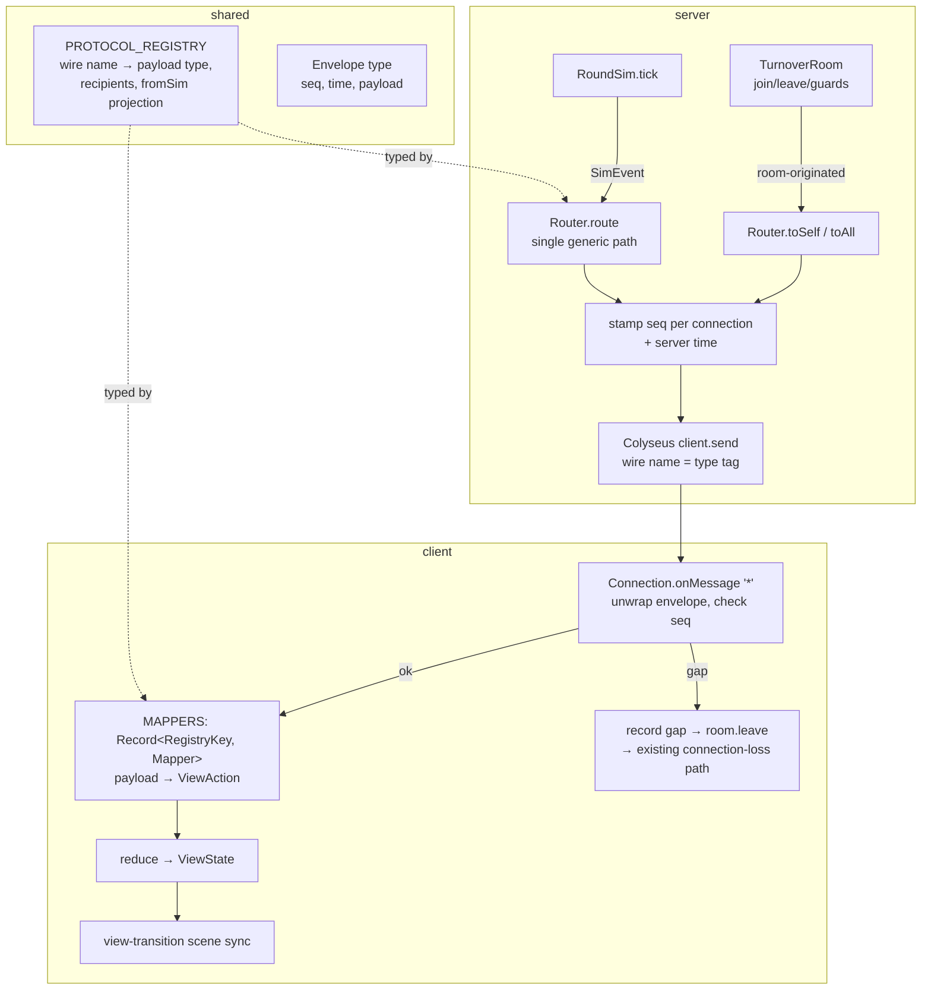

# Protocol Registry Design

**Spec**: `.specs/features/protocol-registry/spec.md`
**Status**: Approved (AD-006 decisions are the design constraints; all grilling
questions user-accepted)

---

## Architecture Overview

One protocol fact is declared exactly once in `packages/shared` (the registry),
applied exactly once on the server (the per-room Router, which stamps a
`{ seq, time, payload }` envelope), and consumed exactly once on the client (a
generic envelope-unwrapping dispatcher over an exhaustive `Record<RegistryKey,
Mapper>` table). No per-type switch survives on any side.



Key mechanism — the registry row is the compile-time spine:

```ts
// packages/shared/src/protocol/registry.ts (shape, not final code)
export type RecipientPolicy = 'all' | 'self'

export interface Envelope<P = unknown> {
  readonly seq: number
  readonly time: number
  readonly payload: P
}

export const PROTOCOL_REGISTRY = {
  'lobby:snapshot': { payload: null as LobbySnapshot, recipients: 'self' },
  'round:started': {
    payload: null as RoundStarted,
    recipients: 'all',
    fromSim: (e) => ({ payload: { playerIds: e.playerIds } }),
  },
  'role:dealt': {
    payload: null as RoleDealt,
    recipients: 'self',
    fromSim: (e) => ({ self: e.playerId, payload: { role: e.role } }),
  },
  'round:buzzer': { payload: null as RoundBuzzer, recipients: 'all', fromSim: () => ({ payload: {} }) },
  error: { payload: null as IntentError, recipients: 'self' },
} as const satisfies { [K in RegistryKey]: Entry<K> } & { [K in SimEvent['type']]: unknown }
```

- `{ [K in RegistryKey]: Entry<K> }` types each row per key (payload matches the
  declared payload type; `fromSim` receives exactly that sim event's variant and
  must return that payload).
- `& { [K in SimEvent['type']]: unknown }` makes a missing sim event key a
  compile error (spec REG-02) while still allowing room-originated keys
  (`lobby:snapshot`, `error` — which have `fromSim: undefined`).
- `payload: null as T` is a type token; the `payload` field is never read at
  runtime, only through `RegistryPayload<K>`.

**SimEvent moves to `packages/shared`.** The spec's exhaustiveness typing
(`satisfies Record<SimEvent['type'], …>`) requires the registry to name
`SimEvent`, but `packages/shared` cannot import `packages/sim` (sim depends on
shared). `SimEvent` is a pure type — part of the protocol surface — so it moves
to `packages/shared/src/protocol/simEvents.ts`; `packages/sim` re-exports it so
sim-internal imports are unchanged. No runtime code moves.

**In-payload `type` literals die.** Wire payloads (`RoundStarted`, `RoleDealt`,
`RoundBuzzer`, `IntentError`) lose their `type` field; the Colyseus wire name is
the only tag (spec REG-08). `LobbySnapshot` already had none.

---

## Code Reuse Analysis

### Existing Components to Leverage

| Component | Location | How to Use |
| --- | --- | --- |
| `SimEvent` union | `packages/sim/src/events.ts` | Moves verbatim to shared; sim re-exports |
| Payload interfaces | `packages/shared/src/protocol/messages.ts` | Keep (minus `type` fields); registry references them |
| Denylist test pattern | `packages/sim/src/literals.test.ts` | Copy the fs-walk + regex pattern for the Router bypass denylist |
| Connection-loss path | `apps/client/src/state.ts` (`connection-lost`), `room.onLeave` | Gap recovery reuses it unchanged |
| Dev hook + strip check | `apps/client/src/debug.ts`, `apps/client/scripts/check-prod-strip.mjs` | Extended with `gaps` + `forceGap`; prod strip invariant re-asserted |
| Room test collectors | `apps/server/src/rooms/TurnoverRoom.test.ts` (`collectAll` via `onMessage('*')`) | Reused for envelope assertions |

### Integration Points

| System | Integration Method |
| --- | --- |
| Colyseus 0.18 send/broadcast | Router is the only module calling `client.send`; broadcasts iterate `room.clients` so each connection gets its own `seq` |
| Colyseus `room.onMessage('*')` on the SDK side | One generic handler unwraps + dispatches (client-side `onMessage('*')` already proven by `collectAll`) |
| Gate ladder | Gate 2 gains `server:protocol_registry`; Gate 3 gains `client:envelope_gap`; existing scenarios must stay green |

---

## Components

### Protocol registry — `packages/shared/src/protocol/registry.ts` (new)

- **Purpose**: The single catalog: per wire name — payload type, recipient
  policy, and (for sim events) the sim-event → wire-payload projection.
- **Interfaces**:
  - `RecipientPolicy = 'all' | 'self'` (closed enum, extended deliberately)
  - `Envelope<P>` — `{ seq, time, payload }`
  - `RegistryKey = keyof typeof PROTOCOL_REGISTRY`
  - `RegistryPayload<K>` / `RegistryRecipients<K>` — indexed lookups off the registry const
  - `KeysWith<R extends RecipientPolicy>` — keys whose declared policy is R
    (`{ [K in RegistryKey]: RegistryRecipients<K> extends R ? K : never }[RegistryKey]`)
- **Dependencies**: `SimEvent` (now in shared), payload interfaces, `Role`.
- **Reuses**: existing payload interfaces in `messages.ts`.
- **Deletes**: `packages/shared/src/protocol/envelope.ts` (dead), the
  `BroadcastGameEvent`/`PrivateGameEvent` unions, `export * from './envelope'`.

### Router — `apps/server/src/rooms/router.ts` (new)

- **Purpose**: Per-room module that applies recipient policies generically and
  stamps envelopes. The only place in `apps/server` allowed to call
  `client.send` (denylist test enforces).
- **Interfaces**:
  - `constructor(room: Room)` — uses `room.clients` and per-`Client.send`
  - `route(event: SimEvent): void` — looks up `PROTOCOL_REGISTRY[event.type]`,
    applies `fromSim`, dispatches per `entry.recipients`. Single generic path,
    no per-type switch. (The registry-union call of `fromSim` needs one
    contained internal cast — TS cannot apply a union of signatures to a union
    argument; isolated inside `route()` with a comment.)
  - `toSelf<K extends KeysWith<'self'>>(key: K, sessionId: string, payload: RegistryPayload<K>)`
  - `toAll<K extends KeysWith<'all'>>(key: K, payload: RegistryPayload<K>)`
    — policy mismatches are compile errors, not review findings.
  - `forget(sessionId: string): void` — drops the counter on leave
    (counters are per-connection; spec REG edge case).
- **Envelope stamping**: `seq` = per-connection counter starting at 1
  (`Map<sessionId, number>`); `time` = `Date.now()` (ms). Broadcast delivers to
  every live client in `room.clients`, each with its own next `seq` (REG-07).
  Recipient mid-disconnect: absent from `room.clients` → dropped silently.
- **Dependencies**: `PROTOCOL_REGISTRY`, Colyseus `Room`/`Client` types.
- **Reuses**: nothing new — it replaces `TurnoverRoom.route()` + private `sendTo`.

### TurnoverRoom — `apps/server/src/rooms/TurnoverRoom.ts` (edited)

- **Purpose**: Unchanged responsibilities; all sends now go through the Router.
- **Changes**: instantiate `Router` in `onCreate`; `onJoin`/`onLeave` snapshot
  fan-out → `router.toSelf('lobby:snapshot', …)`; intent rejections →
  `router.toSelf('error', …)` with the `type`-less payload; `advance()` →
  `router.route(event)`; `onLeave` → `router.forget(sessionId)`; delete
  `route()` and `sendTo()`.

### Client mappers — `apps/client/src/net/mappers.ts` (new)

- **Purpose**: The exhaustive `payload → ViewAction` table.
- **Interface**:
  ```ts
  export const MAPPERS: { [K in RegistryKey]: (payload: RegistryPayload<K>) => ViewAction[] } = {
    'lobby:snapshot': (p) => [{ type: 'snapshot', snapshot: p }],
    'round:started': (p) => [{ type: 'round-started', playerIds: p.playerIds }],
    'role:dealt': (p) => [{ type: 'role-dealt', role: p.role }],
    'round:buzzer': () => [{ type: 'buzzer' }],
    error: (p) => [{ type: 'intent-error', message: p.message }],
  }
  ```
  A registry key without a mapper fails to compile (REG-12). The dispatch call
  site needs one contained cast (`MAPPERS[wireName as RegistryKey]`) — the key
  arrives as a runtime string; exhaustiveness lives in the table's type.
- **Purity**: mappers are pure payload → action. The wall-clock read for
  `roundStartedAt` moves into the reducer's `round-started` case (the reducer is
  the view machine; it already owns every other timestamp-adjacent decision).

### Connection — `apps/client/src/net/connection.ts` (rewritten)

- **Purpose**: Generic envelope consumer + seq guardian.
- **Changes**:
  - Deletes the `ServerMessage` union and all five per-type handlers.
  - One `room.onMessage('*', (wireName, message) => …)` handler:
    1. `recordServerMessage(wireName, message)` — the hook now stores
       `{ type, payload: message.payload, seq, time, at }` (REG-14).
    2. Seq check: expected = `lastSeq + 1` (`lastSeq` starts at 0 per
       connection). On mismatch → `recordGap({ expected, actual })` in the hook
       → `room.leave()` (the `onLeave` callback fires the existing
       `connection-lost` path; REG-16). Counters are per-connection: a new
       `Connection` starts at 0 (REG-17).
    3. Else `lastSeq = seq`; `MAPPERS[wireName](message.payload)` →
       `cb.onActions(actions)`.
  - Callbacks become `{ onActions(actions: ViewAction[]): void; onDisconnect(): void }`.
  - `create`/`open`/`sendStart`/`leave`/`roomId` unchanged.

### App — `apps/client/src/app.ts` (edited)

- **Purpose**: Unchanged responsibilities; the per-type `handleMessage` switch
  dies (REG-13).
- **Changes**: `callbacks().onActions` dispatches each action then renders.
  Phaser scene transitions become view-transition-driven instead of
  message-driven — `syncScenes(previousView)` after each state change: entering
  `'round'` → stop `Boot`, start `Round` with players derived from state
  (`roundPlayers(state.roundPlayerIds, state.snapshot)`); leaving `'round'` →
  stop `Round`. Generic over views, so no new message type ever touches `app.ts`.

### Reducer — `apps/client/src/state.ts` (edited)

- `ViewState` gains `roundPlayerIds: readonly string[]` (set by `round-started`,
  cleared by `buzzer`); `round-started` stamps `roundStartedAt: Date.now()` itself.
- `ViewAction` shapes updated accordingly (`round-started` loses `atMs`, gains
  `playerIds`).

### Debug hook — `apps/client/src/debug.ts` (edited)

- `recordServerMessage(type, envelope)` stores `{ type, payload, seq, time, at }`.
- New: `gaps: { expected: number; actual: number; at: number }[]` on the hook;
  `registerGapProbe(fn)` lets the connection report gaps (no-op in production);
  `forceGap()` — dev-only, shifts the connection's expected seq so the next real
  message is treated as a gap. Harness contract (`window.__TURNOVER__`) extended;
  prod strip check (`check-prod-strip.mjs`) still proves absence (REG-15) — the
  connection only calls debug-module functions, never touches `window` itself.

---

## Data Models

### Envelope (wire)

```typescript
interface Envelope<P = unknown> {
  readonly seq: number   // per-connection, starts at 1, monotonic
  readonly time: number  // server Date.now() ms
  readonly payload: P    // registry payload for the wire name; no `type` field
}
```

### Registry rows (the five declared messages)

| Wire name | Payload | Recipients | fromSim |
| --- | --- | --- | --- |
| `lobby:snapshot` | `LobbySnapshot` | `self` | — (room-originated) |
| `round:started` | `{ playerIds }` | `all` | `(e) => ({ payload: { playerIds: e.playerIds } })` |
| `role:dealt` | `{ role }` | `self` | `(e) => ({ self: e.playerId, payload: { role: e.role } })` |
| `round:buzzer` | `{}` | `all` | `() => ({ payload: {} })` |
| `error` | `{ code, message }` | `self` | — (room-originated) |

---

## Error Handling Strategy

| Error Scenario | Handling | User Impact |
| --- | --- | --- |
| Client observes seq gap | Record gap in dev hook → `room.leave()` → existing connection-loss notice | "connection lost" view; rejoin yields a fresh snapshot (REG-16) |
| Client rejoins after gap | New `Connection` → `lastSeq` resets to 0; server counter is per-connection | Seamless; first envelope of the new connection has `seq: 1` (REG-17) |
| Recipient mid-disconnect at send time | Not in `room.clients` → silently dropped (unchanged Colyseus behavior) | None (edge case in spec) |
| Unknown wire name arrives client-side | Not in `MAPPERS` → impossible by construction; the generic handler ignores it defensively | None |
| Undeclared sim event / unmapped registry key | Compile error (gate 1) — never reaches runtime | None |

---

## Risks & Concerns

| Concern | Location (file:line) | Impact | Mitigation |
| --- | --- | --- | --- |
| Spec wording "existing gate scenarios pass **unmodified**" collides with the accepted wire change (envelope + dropped `type`): server-side tests decode raw payloads | `.specs/features/protocol-registry/spec.md:25`, `TurnoverRoom.test.ts:230,239,453` | Verifier may flag scenario drift | Recorded spec-precision deviation: scenario **semantics and names** are unmodified; their wire decoding (unwrap envelope, drop the `type`-key assertion) is updated mechanically. Client harness scenarios pass truly unmodified (hook records the unwrapped payload). |
| Union-of-`fromSim` signatures can't be applied to a union `SimEvent` argument | `apps/server/src/rooms/router.ts` (new) | Compile friction in the generic path | One contained cast inside `route()`, justified by the registry's own `satisfies` guarantees; denylist test still sees no per-type switch. |
| `onMessage('*')` on the SDK must deliver only user (room-sent) messages | `apps/client/src/net/connection.ts` | Misrouted internal protocol frames would corrupt seq tracking | Already proven client-side by `collectAll` usage in room tests against real servers; the gap detector also only ever sees what the room sends (message-only room, no schema patches). |
| Moving `SimEvent` to shared could tempt future server logic into shared | `packages/shared/src/protocol/simEvents.ts` (new) | Layering erosion | Type-only file, one union, documented as protocol surface; sim re-exports it. |
| Buzzer→re-deal seq continuity could regress if counters were ever sim-scoped | `router.ts` | Broken continuity after phase transitions | Counters live in the room-owned Router and survive `sim = null`; asserted in `server:protocol_registry` (REG-18). |

---

## Tech Decisions (only non-obvious ones)

| Decision | Choice | Rationale |
| --- | --- | --- |
| Where `SimEvent` lives | Moved to `packages/shared/src/protocol/simEvents.ts`; sim re-exports | Spec REG-02 types the registry against `SimEvent['type']`; shared cannot import sim. The union is a protocol type, not sim logic. |
| Exhaustiveness typing | `satisfies { [K in RegistryKey]: Entry<K> } & { [K in SimEvent['type']]: unknown }` | Per-key payload/projection typing plus "every sim event declared" while permitting room-originated keys — the spec's `Record<SimEvent['type'], …>` intent, corrected for the extra room-originated entries the same spec mandates (grilling Q1b). |
| Seq semantics | First envelope `seq: 1`; client expects `lastSeq + 1` from 0; counters strictly per-connection, server-side `forget()` on leave | Simplest continuity contract; REG-17/REG-18 follow directly. |
| Envelope `time` | `Date.now()` ms, stamped, **not consumed** by the reducer this cycle | Spec out-of-scope row; AD-004 divergence note extended by AD-006. |
| Scene transitions | View-transition-driven (`syncScenes`), not message-driven | Keeps `app.ts` free of per-type code while preserving LIGHT-07/13 behavior exactly. |
| Gap recovery UX | Leave → existing connection-lost view; rejoin is the normal join flow | Spec P4.1 names exactly this path; no new UI. |
| Gate 4 (human round) | Not applicable this cycle | Behavior-preserving wire refactor; no player-facing change (spec Problem Statement: "Behavior is preserved"). |

**Project-level decision:** none new — AD-006 already records the architecture.
The `SimEvent`-in-shared placement is feature-local design detail under AD-006.
