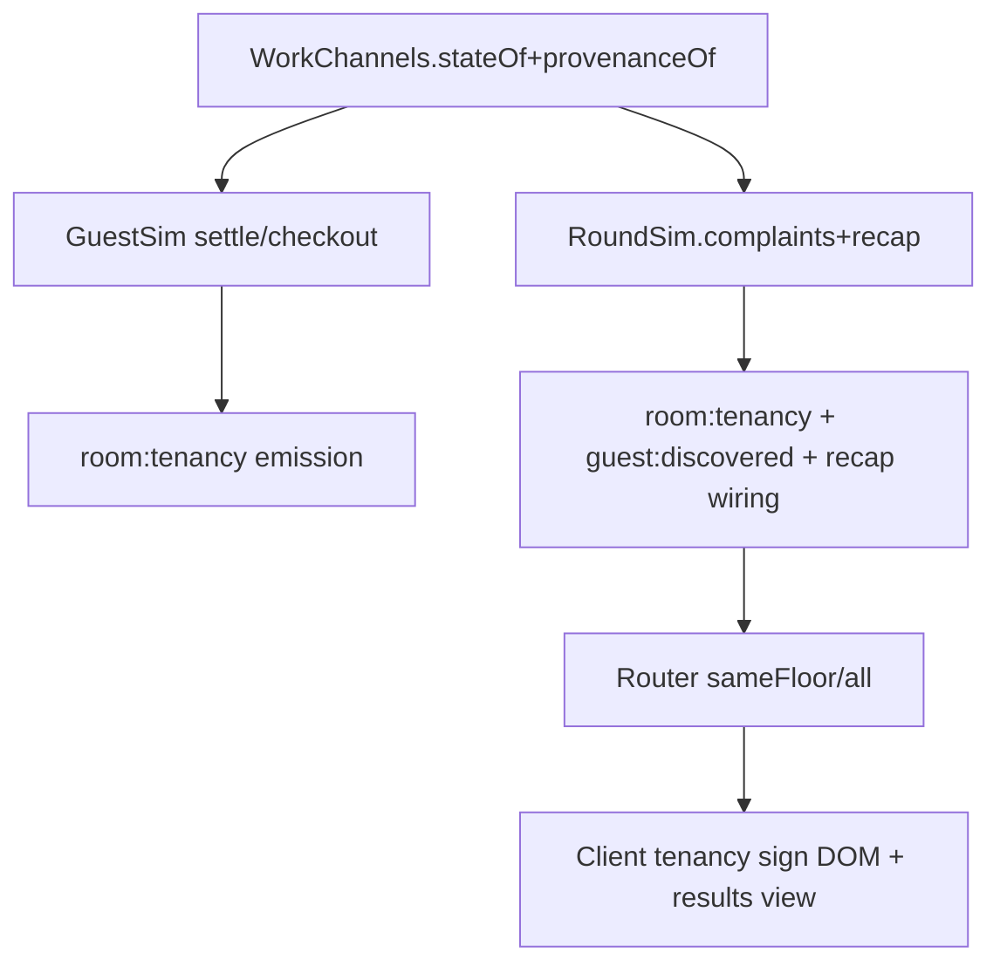

# Provenance Signs Design (cycle 3.4)

**Spec**: `.specs/features/provenance-signs/spec.md`
**Status**: Draft

---

## Architecture Overview

Single-pass cycle across four packages with one new author dimension on rooms and one new hallway-visible tenancy channel. Provenance lives in `WorkChannels` (the room-state owner); tenancy lives in `GuestSim` (the tenancy authority) but is emitted via `WorkChannels`? No — tenancy emits directly from `GuestSim` settle/checkout/discovery paths (the GUEST-09 pattern). `RoundSim` wires the two and builds recap complaint entries. Server routes via registry; client renders a DOM flip-sign per door + recap provenance lines.



---

## Code Reuse Analysis

### Existing Components to Leverage

| Component | Location | How to Use |
| --- | --- | --- |
| `WorkChannels` state + `settleAt` freshness | `packages/sim/src/work.ts` | Add parallel `provenance` map alongside `states`; extend `churnTrash`, prep trashed/settle, clearing on prep |
| `GuestSim` settle/checkout/discovery paths | `packages/sim/src/guests.ts` | Add `room:tenancy` emit at `settleAt`, `driveToExit` checkout, `beginDiscovery` vacant flip; expose `tenanciesOn(floor)` for snapshots |
| `RoundSim` complaint count + `recapEntries()` | `packages/sim/src/roundSim.ts` | Extend complaint journal to carry `provenance`+`actorId`+`fresh`; build new recap `complaint` kind at `recapEntries()` time |
| Protocol registry `sameFloor` policy | `packages/shared/src/protocol/registry.ts` | Add `room:tenancy` row (`sameFloor`, `visibility:{floor}`); add `MovementSnapshot.tenancies` + `SpectatorSnapshot.tenancies` + `RecapEntry complaint` |
| `MovementSnapshot` floor-scoped rows | `packages/shared/src/protocol/messages.ts` | Add `tenancies` rows exactly like `cardedRooms`+`suitcases` — viewer's floor only; spectator gets all floors |
| `WorldScene` door lane + `room:carded` handling | `apps/client/src/scenes/WorldScene.ts` | Add `tenancy` DOM per door (72px doorClosed art anchor, Occupied/Vacant flip); seed from snapshot, update on `room:tenancy` |
| `resultsView` recap rendering | `apps/client/src/ui/resultsView.ts` | Add complaint provenance line rendering alongside existing crime/catch/accusation/ride |
| `state.ts` + `mappers.ts` client dispatch | `apps/client/src/state.ts`, `apps/client/src/net/mappers.ts` | Add `room-tenancy` + recap `complaint` mapping |

### Integration Points

| System | Integration Method |
| --- | --- |
| `apps/server TurnoverRoom` | No new handler; registry projection carries `room:tenancy`; `finishRound` embeds `recapEntries()` with complaints; `movement:snapshot` builder adds `tenancies` array; `spectator:snapshot` similarly |
| `apps/client harness` | `client:tenancy_sign` reuses suitcase/complaint choreography helpers + press-retry pattern |

---

## Components

### 1. `packages/shared` — protocol surface

- **Purpose**: Declare the tenancy and recap-provenance wire shapes exactly once (AD-006).
- **Location**: `packages/shared/src/protocol/messages.ts`, `simEvents.ts`, `registry.ts`, `roomState.ts` if needed
- **Interfaces**:
  - `interface RoomTenancy { floor: GuestFloorId; room: RoomIndex; occupied: boolean }` — the `room:tenancy` payload (hallway-visible, no guestId, no provenance, no freshness)
  - `type TrashProvenance = 'sabotage' | 'churn' | 'none'`
  - `interface MovementSnapshot { ..., tenancies?: readonly RoomTenancy[] }` — sameFloor-scoped; present only when non-empty
  - `interface SpectatorSnapshot { ..., tenancies?: readonly RoomTenancy[] }` — full-building, mirroring `rooms`+`cardedRooms`
  - `type SimEvent = ... | { type:'room:tenancy', floor, room, occupied }` — the sim-internal tenancy event (GuestSim emits; Router projects)
  - `type RecapEntry = ... | { kind:'complaint', tick, floor, room, guestId, fresh, provenance:'sabotage'|'churn', actorId?:string }` — post-reveal only; `actorId` present only when sabotage
- **Dependencies**: `FloorId`, `RoomIndex`
- **Reuses**: Existing `sameFloor` placement pattern for `room:carded`/`suitcase:placed`

### 2. `packages/sim/src/work.ts` — trash provenance

- **Purpose**: Author dimension on every trash room; owner of the provenance map alongside `states`.
- **Location**: `packages/sim/src/work.ts`
- **Interfaces**:
  - `provenanceOf(floor, room): TrashProvenance` — public query for recap + tests
  - `roomStates(): {floor,room,state,provenance}[]` extended? Keep separate query for snapshot consumers — snapshot queries stay state-only until spectator path needs provenance (recap only)
- **Dependencies**: `RoomState`, `TUNING`
- **Reuses**: Existing `states` + `carded` + `settleAt` maps; same lifecycle hooks (`tick` completions, `churnTrash`, prep completion)
- **Behavior**:
  - Init: all 24 `fresh`+`none`; then seed the 7 t=0 `trashed`+`sabotage` deterministically (lowest floors/rooms ascending or seeded — choose lowest 7 — pinned by test)
  - `startWork` un-prep completion → `trashed`+`sabotage`, overwriting any prior churn + resetting `settleAt`
  - `churnTrash` → `settled`+`churn`
  - prep completion → `prepped`+`none` (provenance cleared)
  - `room:settled` aging (fresh window) preserves `sabotage` provenance — state flips `trashed`→`settled` but provenance stays `sabotage`
  - `provenanceOf` mirrors `stateOf` for queries

### 3. `packages/sim/src/guests.ts` — tenancy channel

- **Purpose**: Operate the flip-signs automatically — Occupied on settle, Vacant on checkout or discovery departure.
- **Location**: `packages/sim/src/guests.ts`
- **Interfaces**:
  - Internal: `tenanciesOn(floor): RoomIndex[]` or `tenancyMap(): Map<string,boolean>` for snapshot queries
  - Emitted sim events: `room:tenancy` (3 emits: settle, checkout, discovery)
- **Dependencies**: `WorkChannels.provenanceOf` (read-only via RoomIntelPort extension if needed; but tenancy needs no intel — it owns it)
- **Reuses**: `settleAt` direct + `driveToExit` checkout branch + `beginDiscovery` vacant flip all emit `room:tenancy` in the same flush as their existing `guest:*` events; `MovementPort` untouched
- **Emits**:
  - `settleAt` → `{type:'room:tenancy', floor, room, occupied:true}`
  - `checkout` (`dwellEndsAt` → `toExit`) after `guest:checked_out` → `occupied:false`
  - `beginDiscovery` after `guest:angered` → `occupied:false` (room stays trashed; tenancy never committed)

### 4. `packages/sim/src/roundSim.ts` — recap complaint provenance

- **Purpose**: Carry the complaint's author from discovery tick to recap post-reveal without leaking it pre-round.
- **Location**: `packages/sim/src/roundSim.ts`
- **Interfaces**:
  - `complaintEntries: {tick,floor,room,guestId,fresh,provenance,actorId}[]` private journal populated at `guest:discovered` flush: read `work.provenanceOf(floor,room)` at that tick + `work.stateOf` for fresh (trashed vs settled duplication of guests.ts logic — single source is `provenanceOf`+state)
  - `recapEntries()` appends `complaint` kind rows alongside `crime`/`catch`/`accusation`/`ride`; each `fresh` mirrors the `guest:discovered` payload; `provenance` = `churn` when underlying was `churn`, else `sabotage`; `actorId` = `justice.saboteurId` only on sabotage
- **Dependencies**: `WorkChannels`, `Justice.saboteurId`
- **Reuses**: Existing journal + `emitResult` ordering; `recapEntries()` freshness resolution already reads `work.stateOf`

### 5. `apps/server` — transport shell

- **Purpose**: No new intents; wire the new registry row and carry tenancies/recap through snapshots.
- **Location**: `apps/server/src/rooms/TurnoverRoom.ts`, `router.ts`
- **Interfaces**:
  - `router.toAll('room:tenancy', ...)` via `fromSim` projection (sameFloor)
  - `movement:snapshot` builder adds `tenancies: simGuestsTenanciesOn(viewFloor)` filtered to viewer's floor; `spectator:snapshot` adds all-floor `tenancies`
  - `round:recap` payload builder uses `sim.recapEntries()` including complaint kind (no manual assembly)
- **Dependencies**: Registry `PROTOCOL_REGISTRY`
- **Reuses**: Existing `cardedOn` + `restingSuitcases` snapshot pattern; `finishRound` already maps `sim.recapEntries()` 1:1

### 6. `apps/client` — tenancy overlay + recap lines

- **Purpose**: Hallway-visible Occupied/Vacant per door + results-view complaint provenance.
- **Location**: `apps/client/src/scenes/WorldScene.ts`, `apps/client/src/state.ts`, `apps/client/src/net/mappers.ts`, `apps/client/src/ui/resultsView.ts`
- **Interfaces**:
  - `WorldScene`: per-door DOM node `<div class="door-sign" data-floor data-room data-occupied>` created on floor-lane build (8 per guest floor); seeded from `movement:snapshot.tenancies`, updated on `room:tenancy` sameFloor delivery; spectator baseline seeds all 24
  - `state.ts`: handle `room-tenancy` action → update tenancy map in view state; `round-recap` now carries `complaint` entries
  - `mappers.ts`: `room:tenancy` → `room-tenancy` view action; `round:recap` passthrough already carries entries
  - `resultsView.ts`: render `complaint` entries: `Room F:R — sabotage (by <name>)` vs `Room F:R — checkout churn` plus freshness badge if desired
- **Dependencies**: `TILE_PX`, `ROOM_DEPTH_TILES`, `roomDoorXMilli`
- **Reuses**: Existing `carded` + `suitcase` DOM lanes; `elevatorPresenter` not touched

---

## Data Models

### TrashProvenance

```typescript
type TrashProvenance = 'sabotage' | 'churn' | 'none'
// Stored per room in WorkChannels: Map<string, TrashProvenance>
// Only trashed/settled carry sabotage/churn; prepped/fresh carry none
```

### RoomTenancy event (sim-internal)

```typescript
type TenancyEvent = { type: 'room:tenancy', floor: GuestFloorId, room: RoomIndex, occupied: boolean }
```

### Recap Complaint Entry

```typescript
type RecapComplaint = {
  kind: 'complaint'
  tick: number
  floor: FloorId
  room: RoomIndex
  guestId: string
  fresh: boolean
  provenance: 'sabotage' | 'churn'
  actorId?: string // present ⇔ provenance==='sabotage'
}
```

**Relationships**: One `room:tenancy` per settle/checkout/discovery; one `complaint` recap entry per `guest:discovered`; tenancy is orthogonal to `room:carded` (prep history vs tenancy).

---

## Error Handling Strategy

| Error Scenario | Handling | User Impact |
| --- | --- | --- |
| Tenancy emit for a room already in target state | Idempotent on client — DOM update overwrites same value | None visible |
| Complaint fires for a room with `provenance==='none'` (clean room) | Impossible per guests.ts arrival guard (only trashed/settled com plain); test asserts panic if hit | No wire leak |
| Initial 7 seeding collides with seeded-Rng guest draws | Seeding is deterministic and Rng-free — lowest 7 rooms (floor1 R1..R7) avoids Rng branch | None |
| Harness stage hitsElevator contention with guest traffic | Press-retry pattern from suitcase.spec reused; shift seam `TURNOVER_TEST_GUEST_SCALE=0.2` keeps cadence slow | Test stable |

---

## Risks & Concerns

| Concern | Location | Impact | Mitigation |
| --- | --- | --- | --- |
| `WorkChannels` now owns both state and provenance — coupling risk | `packages/sim/src/work.ts:45` | Future readers may decouple them incorrectly | Provenance map co-located, tested via `provenanceOf` table tests |
| Tenancy emits must not race the guest tick ordering | `packages/sim/src/guests.ts:315` | Checkout discovery emit order affects which hallway viewer sees Vacant when | Emits in same flush as existing guest events, before movement drivers; harness asserts ordering |
| No initial 7 trashed rooms currently exist (all fresh at start) | `packages/sim/src/work.ts:58` | Initial-7 sabotage seed would be a behavioral change | Add the seed in this cycle and pin via a dedicated `provenance.test.ts` + update 24-state snapshot expectations |
| Client per-door DOM could drift on rapid floor switches | `apps/client/src/scenes/WorldScene.ts: doors-layer` | Stale signs if snapshot seeding missed | Snapshot seeded on every `movement:snapshot` + `spectator:snapshot`; sameFloor updates keep lanes fresh |

---

## Tech Decisions

| Decision | Choice | Rationale |
| --- | --- | --- |
| Tenancy policy `sameFloor` not `all` | `sameFloor` `visibility:{floor}` | Hallway-visible per-floor like `room:carded`; lobby sees no guest-floor doors — matches FR-10 cue half |
| Recap complaint kind `complaint` not reuse `crime` | New kind with `guestId+fresh+provenance+actorId` | Crimes and complaints are distinct beats with different payloads and budget effects |
| Initial 7 seed: lowest 7 rooms vs RNG | Lowest 7 (floor1 R1..R7) | Deterministic, no Rng cost, test-stable |
| Provenance cleared on prep | `none` on `prepped` | A clean room has no author — consistent with PRD FR-22 reveal scope |

