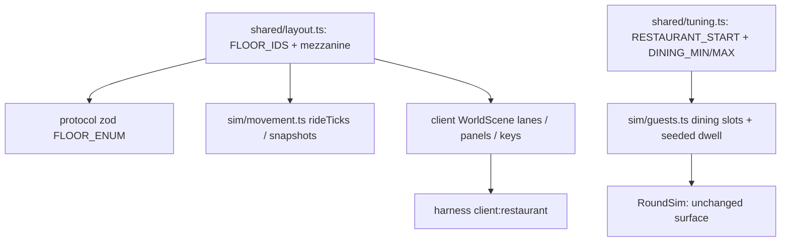

# Restaurant Floor Design

**Spec**: `.specs/features/restaurant-floor/spec.md`
**Status**: Draft (autonomous run — assumptions logged in the spec)

---

## Architecture Overview

One layout widening (shared) ripples through three consumers; one sim rework
(guests) swaps the holding stub for the mezzanine restaurant; the client gains a
view + rider affordances for the new floor. No new registry messages (AD-006):
the only protocol surface change is `FloorId` widening, which flows
automatically through `FLOOR_ENUM` (`elevator:press`, `movement` intents) and
position events.



### Approach (chosen)

**Conform to AD-010's geometry, widen its floor set.** The alternative —
deriving floors from a `FLOORS` count or re-pinning room geometry — was
rejected: `FLOOR_IDS` is already the single floor source (types, zod, rideTicks
all derive from it), and room geometry is floor-agnostic by construction
(`roomIndexAtMilli` ignores floors). The mezzanine is therefore a one-element
insert, exactly as the roadmap planned. Guest dining reuses the NPC re-place
pattern (`removeGuest`/`joinGuest` teleport) — the same machinery the queue and
3.B holding stub always used — rather than a new walk-to-restaurant driver.

## Code Reuse Analysis

### Existing Components to Leverage

| Component | Location | How to Use |
| --- | --- | --- |
| `FLOOR_IDS`-derived plumbing | `packages/shared/src/layout.ts:4`, `protocol/intents.ts:10` | Widening auto-flows to `FloorId`, zod enums, `rideTicks` (`movement.ts:814`) |
| NPC re-place pattern | `packages/sim/src/guests.ts:303` (`rePlaceQueue`) | Dining slot placement/compaction, identical mechanics one floor up |
| Seeded guest Rng stream | `packages/sim/src/guests.ts:152` | Dining dwell draw (no `Math.random` — phase rule) |
| `GuestTiming` test seam | `packages/sim/src/guests.ts:84`, `TurnoverRoom.ts:73` | Gains `diningScale`, wired via the existing `TURNOVER_TEST_GUEST_SCALE` env |
| Wrong-delivery return path | `packages/sim/src/guests.ts:611` | Retargeted from holding slots to dining slots |
| Floor view machinery | `apps/client/src/scenes/WorldScene.ts:57` (`SPECTATOR_LANE_Y`), panels loop `:407` | Mezzanine lane + panels; door-frame loop `:1150` already excludes non-guest floors |
| Car screen / rider chip | `apps/client/src/ui/carScreen.ts` | `M` button, label, floor order |

### Integration Points

| System | Integration Method |
| --- | --- |
| Protocol registry | Zero new entries; `FloorId` widening validated by the existing `elevator:press` registry test (iterates `FLOOR_IDS`) |
| Spectator overview | `TurnoverRoom.ts:667` floor list gains `mezzanine` |
| RoundSim | No signature change; guests.ts internals only |

---

## Components

### shared/layout + tuning (shared contract)

- **Purpose**: Declare the 5-floor building and the dining dials.
- **Location**: `packages/shared/src/{layout,tuning}.ts`
- **Changes**: `FLOOR_IDS` gains `'mezzanine'` between `lobby` and `floor1`;
  `GUEST_HOLD_START_TILES` renamed `GUEST_RESTAURANT_START_TILES` (value 18);
  new `GUEST_DINING_MIN_SECONDS = 15`, `GUEST_DINING_MAX_SECONDS = 30` (roadmap
  v1.4 dial — §7-external, recorded in AD-035).
- **Reuses**: Existing constants; no geometry change.

### sim/guests (dining phase)

- **Purpose**: Checked-in guests wait in mezzanine dining slots with a seeded
  dwell buffer.
- **Location**: `packages/sim/src/guests.ts`
- **Interfaces**:
  - `diningDwellOf(guestId): number | null` — the drawn dwell ticks of the
    current dining stay (test + future telemetry surface; the dwell itself has
    no behavioral consequence — spec REST-10).
- **Changes**: phase `'waiting'` → `'dining'` (internal rename; never
  transmitted); `holding` → `dining` slots on the mezzanine at
  `GUEST_RESTAURANT_START_TILES + slot × GUEST_QUEUE_SPACING_TILES`; dwell drawn
  at each dining placement (check-in, wrong-delivery return), stored, cleared on
  departure; `GuestTiming.diningScale` scales it (AD-004 seam pattern);
  `dropCarry` re-queue unchanged (floor-agnostic teleports).
- **Reuses**: `rePlaceQueue` mechanics, Rng stream, `retargetOnRest`.

### sim/movement (no code change expected)

- **Purpose**: Verify floor-genericity; re-pin ride-timing tests.
- **Location**: `packages/sim/src/movement.ts`, `movement.test.ts`
- **Changes**: `rideTicks` derives lobby↔floor1 = 2 strides automatically; any
  explicit floor enumerations found in the sweep get replaced by `FLOOR_IDS`
  iteration; tests re-pinned.

### apps/server (routing seams)

- **Purpose**: Include the mezzanine in floor-enumerating routing.
- **Location**: `apps/server/src/rooms/TurnoverRoom.ts`
- **Changes**: spectator overview floor list; `testGuestTiming` wiring for
  `diningScale`; snapshot routing audited (already per-floor generic, AD-009).

### apps/client (mezzanine view + dining cues)

- **Purpose**: The mezzanine is a first-class floor view.
- **Location**: `apps/client/src/scenes/{WorldScene,BootScene}.ts`,
  `apps/client/src/ui/{carScreen,roundHud,lobbyView}.ts`
- **Changes**: `SPECTATOR_LANE_Y.mezzanine` between lobby and floor1 (Y value
  interpolated); panels + hall-call lights on the mezzanine view; `KeyM` =
  in-car mezzanine press and mezzanine view switch; car screen button `M`
  (order 3/2/1/M/L, top-down), `FLOOR_LABELS.M`, `FLOOR_ORDER` ground-up with
  mezzanine second; HUD/lobby floor indicators gain `M`; guest markers on the
  mezzanine render a gray-box dining chip; door frames untouched (guest-floors
  loop already).
- **Reuses**: every existing lane/panel/chip path.

### harness (gate)

- **Purpose**: `client:restaurant`.
- **Location**: `apps/client/harness/restaurant.spec.ts` (new)
- **Scenario**: join → ride to mezzanine (M press) → mezzanine view renders
  (lane, panels, no door frames) → a checked-in guest appears in a dining slot
  with the dining chip; `TURNOVER_TEST_GUEST_SCALE` shortens the flow.

---

## Data Models

```typescript
interface Guest {
  // existing fields…
  phase: 'queued' | 'impatient' | 'dining' | 'toRoom' | 'settling' | 'toExit'
  /** Ticks of the drawn dining dwell for the CURRENT dining stay; null when
   *  not dining. No behavioral consumer (REST-10) — determinism/telemetry only. */
  diningDwellTicks: number | null
}
```

Tuning additions (all §7-external, recorded per the tuning rule):

```typescript
GUEST_RESTAURANT_START_TILES: 18   // renamed from GUEST_HOLD_START_TILES
GUEST_DINING_MIN_SECONDS: 15       // roadmap v1.4 dial
GUEST_DINING_MAX_SECONDS: 30
```

---

## Error Handling Strategy

| Error Scenario | Handling | User Impact |
| --- | --- | --- |
| `suitcase:place` on the mezzanine | Ignored (`pos.floor` not a guest floor) | Silent no-op, same as lobby today |
| `elevator:press 'mezzanine'` on a guest floor | Valid (FLOOR_ENUM) | Car serves the stop |
| Guest drop/teardown while dining | Existing `dropCarry` floor-agnostic re-queue | Guest re-queued at the desk front |
| Harness timing vs 5-stop economy | `TURNOVER_TEST_GUEST_SCALE` + existing press-retry pattern | Scenarios absorb slower lobby↔floor1 rides |

---

## Risks & Concerns

| Concern | Location | Impact | Mitigation |
| --- | --- | --- | --- |
| Ride-timing pins break (`lobby↔floor1` doubles) | `packages/sim/src/movement.test.ts`, `elevatorLobby.spec.ts` | Flaky red gates | Sweep all ride-time-derived waits; re-pin explicitly (spec edge case) |
| Cross-floor guest teleport visible | `guests.ts` re-place on check-in | Guest pops lobby→mezzanine | Accepted (established NPC re-place pattern; gray-box); playtest revisit via a new AD |
| Rng stream shift (extra draw at check-in) changes downstream draws (dwell/self-assign) | `guests.ts` | Deterministic tests re-pinned | One draw at dining placement; suites re-pinned, not weakened |
| `indexOf`-based ride cost makes mezzanine stops add latency to every floor1 trip | `movement.ts:815` | Elevator economy slower | Accepted — roadmap explicitly buys 5 stops; 3.5 balance gate re-proves |

---

## Tech Decisions (only non-obvious ones)

| Decision | Choice | Rationale |
| --- | --- | --- |
| Dining arrival | NPC teleport (re-place pattern), not a walk/elevator driver | Smallest change consistent with the queue/holding precedent; a driver phase adds risk for zero gate value; playtest can upgrade via AD |
| Dwell with no consumer | Draw + store + `diningDwellOf` query | Proposal: "buffer, not a schedule"; keeps Rng determinism explicit and testable without inventing behavior |
| Phase rename `waiting`→`dining` | Internal only | The phase is never transmitted; the name matches the domain vocabulary |
| Mezzanine lane Y | Interpolated between lobby and floor1 in `SPECTATOR_LANE_Y` | Spectator overview stays top-down ordered ground-up |

> **Project-level decisions:** AD-035 will be appended to STATE.md: the
> mezzanine layout widening (amends AD-010's floor set, geometry untouched),
> the dining dials + constant rename (amends AD-033(b)/(c)), and the
> autonomous-run defaults (FLOOR_IDS order, M key, teleport arrival).
