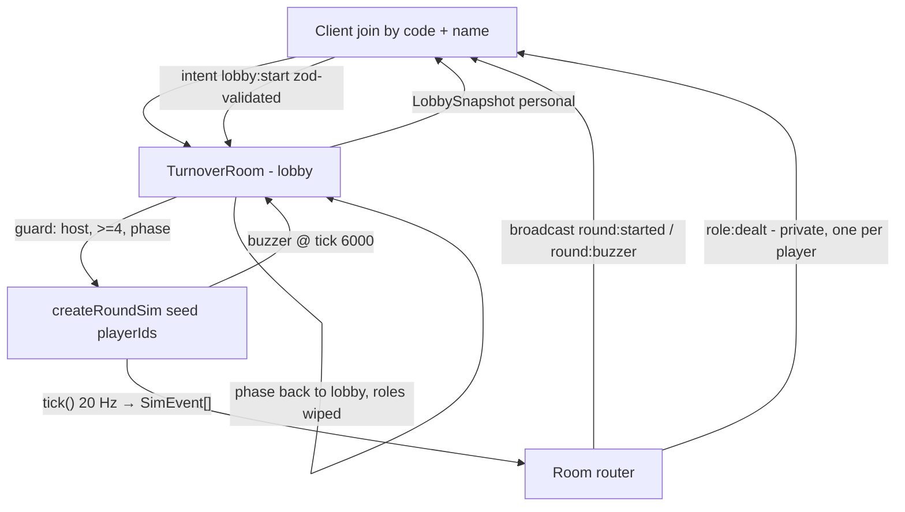

# Room Shell Design

**Spec**: `.specs/features/room-shell/spec.md`
**Status**: Approved

Conforms to AD-001 (single Fastify process, noServer + attach, message-only rooms,
`patchRate = null`). Adds AD-002: room owns the lobby, sim owns the round (below).

---

## Architecture Overview

The Colyseus room (`TurnoverRoom`) is a transport shell and lobby manager. The pure sim
(`RoundSim`) exists only between host-start and buzzer, created with a seed and the
joined player ids, ticking at 20 Hz, emitting events that the room routes to clients.
No Schema state; every client-bound payload is a routed message derivable from the
recipient's legitimate knowledge (turnover-protocol rules).



Phases: `lobby` → (host start) → `round` → (buzzer) → `lobby`. Lobby state lives only
in the room; round state lives only in the sim.

---

## Code Reuse Analysis

### Existing Components to Leverage

| Component | Location | How to Use |
| --- | --- | --- |
| `TUNING` | `packages/shared/src/tuning.ts` | PLAYERS_MIN/MAX, SHIFT_SECONDS — verbatim, never re-declared |
| Envelope types | `packages/shared/src/protocol/envelope.ts` | `PersonalSnapshot`, `GameEventEnvelope`, `BroadcastEventEnvelope`, `PlayerIntent` — concrete catalog fills these shapes |
| `PlaceholderRoom` pattern | `apps/server/src/rooms/PlaceholderRoom.ts` | patchRate-null message-only room; replaced by `TurnoverRoom`, its integration tests migrate |
| Fastify+Colyseus boot | `apps/server/src/index.ts` | Unchanged attach (AD-001); only room registration swaps |
| vitest workspace + gate scripts | root `package.json` | `pnpm test:sim` / `pnpm test:client` unchanged |

### Integration Points

| System | Integration Method |
| --- | --- |
| Colyseus 0.18 matchmaking | 4-letter code assigned to `roomId` in `onCreate`; clients `joinById(code)` — collision retried on create |
| Colyseus 0.18 zod `validate()` | `lobby:start` intent validated + guarded in the room's `messages` map |
| Colyseus `setSimulationInterval(50)` | Drives `RoundSim.tick()` while phase = `round` (one tick per fire; sim counts ticks, never wall time) |

---

## Components

### `dealRoles` + seeded RNG

- **Purpose**: Pure role deal — exactly one saboteur for the given seed and player ids.
- **Location**: `packages/sim/src/deal.ts`
- **Interfaces**:
  - `dealRoles(seed: number, playerIds: readonly string[]): Map<string, Role>` — `Role = 'staff' | 'saboteur'` (type lives in `packages/shared/src/roles.ts`; the shared message catalog needs it for `role:dealt`, and `packages/sim` already depends on shared)
  - `mulberry32(seed: number): () => number` — tiny seeded PRNG, no deps
- **Dependencies**: none (pure)
- **Reuses**: nothing; first real sim code

### `RoundSim`

- **Purpose**: Headless round state machine — clock, deal, buzzer; every later Phase 2 cycle extends this class.
- **Location**: `packages/sim/src/roundSim.ts`
- **Interfaces**:
  - `createRoundSim(config: { seed: number; playerIds: readonly string[] }): RoundSim`
  - `tick(): readonly SimEvent[]` — advances 0.05 s; 6000th tick emits `round:buzzer`
  - `clockTicksRemaining: number` (starts 6000)
- **Dependencies**: `dealRoles`, `TUNING.SHIFT_SECONDS`
- **Reuses**: nothing yet; designed as the single extension point for 2.2–2.6

### `TurnoverRoom`

- **Purpose**: Lobby manager, guard logic, sim lifecycle, event routing.
- **Location**: `apps/server/src/rooms/TurnoverRoom.ts` (registered as `'turnover'`; `PlaceholderRoom` deleted)
- **Interfaces** (overrides):
  - `onCreate` — `patchRate = null`, assign 4-letter `roomId` (uppercase, no `O`/`I` — read-aloud safety), `setSimulationInterval`
  - `onJoin(client, options: { name: string })` — LOBBY-01..05 validation, roster append, `LobbySnapshot` send
  - `onLeave(client)` — CHURN-01..03 (host migration, idle slot mid-round)
  - `messages` map — zod-validated `lobby:start` → DEAL-01..05 guards → `createRoundSim` → event routing
- **Dependencies**: `RoundSim`, shared protocol types, `TUNING`
- **Reuses**: PlaceholderRoom's message-only configuration and test hook pattern

### Message catalog (in `packages/shared/src/protocol/messages.ts`)

Every type carries its recipient comment (protocol rule 5):

| Type | Direction / recipients | Payload |
| --- | --- | --- |
| `LobbySnapshot` | server → one player, on join + roster change | own id, name, isHost, roster (ids + names) |
| `round:started` | server → all, broadcast | playerIds in deal order (ids only) |
| `role:dealt` | server → one player, private | `{ role: 'staff' \| 'saboteur' }` — own role only |
| `round:buzzer` | server → all, broadcast | `{}` |
| `error` | server → one player | `{ code, message }` for intent rejections (join rejections use Colyseus join errors) |
| `lobby:start` | client → server intent | `{}` (zod: empty object) |

Role secrecy: own role in a personal payload is legitimate knowledge (protocol rule 1);
no other player's role ever appears in any payload — DEAL-02 asserts this payload-wide.

---

## Data Models

```typescript
// apps/server/src/rooms/TurnoverRoom.ts (room-local, never transmitted as-is)
interface LobbyPlayer {
  sessionId: string   // Colyseus client session id = sim player id
  name: string        // validated 1–16 chars, unique
  joinedAt: number    // monotonic counter — host migration order
}

type RoomPhase = 'lobby' | 'round'

// packages/sim/src/events.ts (concrete SimEvent union starts here; 2.2+ extend it)
type SimEvent =
  | { type: 'round:started'; playerIds: readonly string[] }
  | { type: 'role:dealt'; playerId: string; role: Role }   // room routes privately
  | { type: 'round:buzzer' }
```

**Relationships**: `RoundSim` receives `playerIds` (session ids) so sim events map 1:1
to room clients without a lookup table.

---

## Error Handling Strategy

| Error scenario | Handling | User impact |
| --- | --- | --- |
| Bad/unknown room code | Colyseus join rejection (`room not found`) | Join fails; client retries with new code |
| 7th join / mid-round join / bad or taken name | Colyseus join rejection with specific reason | Join fails with reason; roster unchanged |
| Start with <4 players | intent rejected, `error { code: 'need-more-players' }` | Start button shows reason; no state change |
| Non-host start / double start | `error { code: 'not-host' }` / `'round-already-active'` | No state change |
| Host leaves mid-lobby | host migrates to earliest `joinedAt`; roster broadcast | Round start still available |
| Player leaves mid-round | sim keeps running; slot idles to buzzer | Round completes; reconnect is 2.6 |

---

## Risks & Concerns

| Concern | Location | Impact | Mitigation |
| --- | --- | --- | --- |
| Custom `roomId` assignment + `joinById` by code is asserted from docs, not yet proven in this repo | `TurnoverRoom.onCreate` | Join-by-code silently broken | `server:lobby_join` gate boots the real server and joins by generated code — the gate proves it before anything stacks on it |
| `setSimulationInterval` fires late under load; wall-clock drift would break buzzer exactness | `TurnoverRoom` interval | Non-deterministic round length | Sim counts ticks (0.05 s per `tick()`), never reads a clock; exactness tests call `tick()` directly in vitest, interval is a production driver only |
| 4-letter code space (24² with restricted alphabet ≈ 390k) exhausts under test loops | `onCreate` | Create retry storm | Retry capped, draw without replacement from remaining codes in-process; CI scale is tiny |
| Seed leaks roles if echoed in any message | event routing | Hidden-info leak | Seed is never part of `SimEvent` or any shared type; DEAL-02 payload audit + Verifier grep cover it |

---

## Tech Decisions (only non-obvious ones)

| Decision | Choice | Rationale |
| --- | --- | --- |
| Lobby vs sim split | Room owns lobby, sim owns round (**AD-002**) | Join/leave/name churn is transport-shaped; keeping it out of the sim keeps the pure core minimal and deterministic for 2.2–2.6 |
| Player identity | Colyseus sessionId doubles as sim player id | No aliasing table; sim events route 1:1 |
| PRNG | mulberry32 (own ~5-line impl in `packages/sim`) | Deterministic, dependency-free, adequate for a deal shuffle |
| Code alphabet | 24 letters (no `O`, `I`) | Read-aloud safety over dictation errors; 390k space ≫ concurrent room count |
| Join-time role knowledge | Roles dealt only at host-start, never at join | FR-2: "assigned secretly at lobby gather-up"; re-deal reuses the same path |
