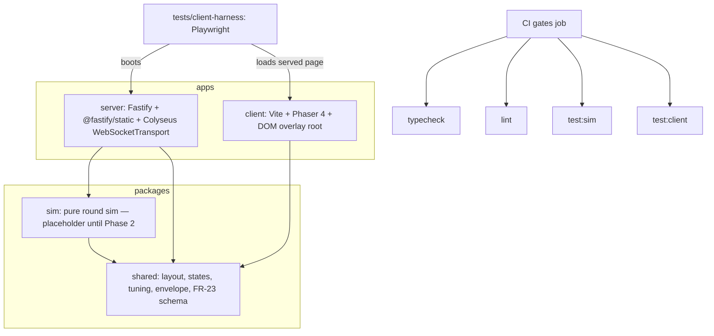

# Monorepo Skeleton Design

**Spec**: `.specs/features/skeleton/spec.md`
**Status**: Draft

---

## Architecture Overview

Four pnpm workspace members under one lockfile. Dependency flow is strictly one-way:
`shared` is imported by everyone; `sim` imports `shared` and stays pure; `server`
imports `sim` + `shared` (Phase 2 wires the sim into the room); `client` imports
`shared` only. Nothing imports downward into an app.



Build/dev flow:

- `pnpm dev` → `apps/server` via tsx watch; `apps/client` via Vite dev server proxying WS + static to the server port.
- `pnpm build` → client bundles to `apps/client/dist` (tsup builds the server entry in Phase 2 when it has real logic; Phase 1 runs the server from source with tsx).
- Root scripts fan out via `pnpm -r` (or `-w` for typecheck with project-wide `tsc -b`).

## Code Reuse Analysis

Greenfield repo — nothing to reuse in-tree. What is reused from docs:

| Asset | Location | How to Use |
|---|---|---|
| Roadmap "Key API facts" (verified 2026-08-27) | `roadmap.md:90-105` | Implementation facts: `WebSocketTransport({ server })`, `patchRate = null`, `@colyseus/testing`, Phaser 4 `moduleResolution: "bundler"` |
| CI gate contract | `.github/workflows/ci.yml` | Root script names are fixed: `typecheck`, `lint`, `test:sim`, `test:client` — do not rename |
| `__TURNOVER__` hook contract | `.opencode/skills/turnover-client-harness/SKILL.md` | Dev/harness builds only, stripped from prod |
| Protocol conventions | `.opencode/skills/turnover-protocol/SKILL.md` | Message-type naming + recipient-comment audit rule for the envelope types |

## Components

### Root workspace

- **Purpose**: Single lockfile, engine pins, fan-out gate scripts, shared Biome + tsconfig bases.
- **Location**: repo root (`pnpm-workspace.yaml`, `package.json`, `biome.json`, `tsconfig.base.json`)
- **Interfaces** (root scripts, names locked by CI): `typecheck`, `lint`, `test:sim`, `test:client`, `dev`, `build`
- **Dependencies**: pnpm ≥10, Node ≥22 (engines); CI runs Node 24.
- **Reuses**: `.github/workflows/ci.yml` as-is.

### packages/shared

- **Purpose**: Only source of layout constants, room states, prd §7 tuning; protocol envelope + FR-23 telemetry schema types.
- **Location**: `packages/shared/src/` — `layout.ts`, `roomState.ts`, `tuning.ts`, `protocol/` (envelope + telemetry).
- **Interfaces**:
  - `LAYOUT` — grand lobby + 3 floors × 8 rooms (24 rooms)
  - `type RoomState = 'prepped' | 'trashed' | 'fresh' | 'settled'` — closed union, named per prd FR-10
  - `TUNING` — verbatim prd §7 constants (each with a `Reserve dial` comment where §7 assigns one)
  - `protocol/` — per-player event stream + personal-snapshot envelope types; client→server intent base; FR-23 event schema (typed unions for room transitions, elevator calls/rides, catches, accusations, 1/s coverage samples). Every exported message type carries its intended-recipient comment (protocol-skill audit rule).
- **Dependencies**: none (pure types + constants; zero runtime deps).
- **Reuses**: prd §7 table, roadmap step 0 layout.

### packages/sim

- **Purpose**: Pure round sim, 20 Hz tick (Phase 2). Phase 1 ships one placeholder vitest scenario importing shared constants — proves cross-workspace resolution and gives gate 2 a real exit 0.
- **Location**: `packages/sim/`
- **Dependencies**: `@turnover/shared` (workspace dep).
- **Reuses**: nothing yet.

### apps/server

- **Purpose**: Transport shell — Fastify serving static client + Colyseus WS on one port, one placeholder message-only room.
- **Location**: `apps/server/src/` — `index.ts` (Fastify bootstrap), `rooms/PlaceholderRoom.ts`
- **Interfaces**:
  - `startServer(port?)` → boots Fastify + Colyseus on one port (ephemeral in tests)
  - `PlaceholderRoom` — `patchRate = null`, no Schema state; join-only
- **Dependencies**: `fastify`, `@fastify/static`, `colyseus@0.18`, `ws` (default transport), `tsx` (dev).
- **Reuses**: AD-001 attach pattern (`new WebSocketTransport({ server: fastify.server })`).

### apps/client

- **Purpose**: Phaser 4 shell rendering a placeholder scene; DOM overlay root above the canvas; dev-only `window.__TURNOVER__`.
- **Location**: `apps/client/src/` — `main.ts` (boot), `scenes/BootScene.ts` (placeholder), `overlay/` (empty mount)
- **Interfaces**:
  - `window.__TURNOVER__` — injected only when `import.meta.env.MODE !== 'production'` (dev/harness); prod bundle tree-shakes it out
- **Dependencies**: `phaser@^4.2.1`, Vite, `@turnover/shared` (workspace dep).
- **Reuses**: Phaser 4 tsconfig fact (`moduleResolution: "bundler"`), client-harness hook contract.

### tests/client-harness (gate 3 runner)

- **Purpose**: Minimal Phase 1 boot check — Playwright launches headless Chromium, boots the real server + served client, asserts Phaser boot hook exists.
- **Location**: `apps/client/harness/` (lives with the client it tests; root script `test:client` runs it)
- **Dependencies**: `@playwright/test` (Chromium only), server boot helper.
- **Reuses**: `window.__TURNOVER__` contract.

## Data Models

### Layout (shared, `layout.ts`)

```typescript
export const FLOORS = 3
export const ROOMS_PER_FLOOR = 8
export const ROOM_COUNT = FLOORS * ROOMS_PER_FLOOR // 24
export const FLOOR_IDS = ['lobby', 'floor1', 'floor2', 'floor3'] as const
```

### Tuning (shared, `tuning.ts`) — verbatim prd §7, typed constants

```typescript
export const TUNING = {
  PLAYERS_MIN: 4,
  PLAYERS_MAX: 6,
  SHIFT_SECONDS: 300,
  PREP_SECONDS: 5,
  UNPREP_SECONDS: 3,
  COVERAGE_TARGET: 0.8,
  FRESHNESS_WINDOW_SECONDS: 75,
  RUSTLE_RANGE_TILES: 3,
  ELEVATOR_ARRIVE_SECONDS: 3,
  ELEVATOR_RIDE_SECONDS_PER_FLOOR: 2,
  ELEVATOR_CAPACITY: 2,
  PLAYER_SPEED_TILES_PER_SEC: 6,
  ACCUSATION_RANGE_TILES: 2,
} as const
// Reserve dial order (prd §7): un-prep → 2s if saboteur weak; attrition scaling by lobby size.
```

### Envelope + telemetry (shared, `protocol/`)

```typescript
/** Server → one player: what this recipient legitimately knows now (protocol rule 1). */
export interface PersonalSnapshot { /* Phase 2 fills concrete view fields */ }

/** Server → per-player event stream: past-tense domain events only. */
export interface GameEvent { type: string; time: number }

/** Client → server intent (Colyseus 0.18 zod validate() handlers in Phase 2). */
export interface PlayerIntent { type: string }

/** FR-23 JSONL telemetry event (server-authoritative, mirrors the event stream 1:1). */
export interface TelemetryEvent {
  kind: 'room-transition' | 'elevator-call' | 'elevator-ride' | 'walk-in-catch' | 'accusation' | 'coverage-sample'
  actor?: string
  time: number
  wasTargetSaboteur?: boolean
  crimeOccurred?: boolean
  coverage?: number
}
```

Concrete shapes are Phase 2's message catalog — the Phase 1 contract is that these
envelope types exist, are imported unmodified by later phases, and carry
recipient comments.

## Error Handling Strategy

| Error Scenario | Handling | User Impact |
|---|---|---|
| Node <22 at install | `engines` fails install fast | Clear pnpm error, no half-booted workspace |
| One workspace fails typecheck | Root `typecheck` fans out per workspace; non-zero propagates | CI names the failing workspace, doesn't mask |
| Harness served a prod build (no hook) | Boot-check asserts `__TURNOVER__` exists → fails loudly | Signals wrong build mode, never silent-pass |
| Server port occupied | Dev: tsx watch restart surfaces error; tests use ephemeral ports | No silent fallback port |

## Risks & Concerns

| Concern | Location | Impact | Mitigation |
|---|---|---|---|
| Fastify + `WebSocketTransport` attach is undocumented combination | `apps/server/src/index.ts` | Wrong import shape wastes a task cycle; we are the only reference | Verify exact 0.18 import path (`colyseus-ws` / transport export) against installed package types at implementation time — flagged per Knowledge-Verification-Chain step 5, never assumed; task includes boot test as proof |
| `@colyseus/testing` vs plain `client.connect` for the boot test | `apps/server` tests | Overkill setup for a join-only smoke | Use `@colyseus/testing` (`boot() → createRoom → connectTo`) — official, already verified in roadmap |
| Vitest config sprawl (root vs per-package) | root `vitest.workspace.ts` | Duplicated config drift between sim and harness | One `vitest.workspace.ts` at root referencing `packages/sim` and `apps/client/harness` projects |
| Playwright chromium download in CI is slow/flaky | CI already runs `pnpm exec playwright install --with-deps chromium` | Nothing to fix in Phase 1 — contract pre-exists | Keep `test:client` script name stable; do not add browser matrix |
| Grepping tuning literals (SKEL gate) is heuristic | `packages/sim`, `apps/*` | A sloppy constant slips through review | Gate-2 test asserts a small denylist of literal values (300, 75, 6, 0.8…) does not appear outside `packages/shared/src` |

## Tech Decisions (only non-obvious ones)

| Decision | Choice | Rationale |
|---|---|---|
| Server runs from TS in dev and tests | tsx (no tsup build in Phase 1) | Server has no logic to bundle yet; tsup lands in Phase 2 with the real entry. Avoids a build step nothing consumes |
| Typecheck fan-out | Root script runs `pnpm -r typecheck`; each workspace package owns `typecheck: tsc --noEmit -p tsconfig.json` | Solution-style `tsc -b` fails (TS18003) with zero references, i.e. in T1 before packages exist; per-package `--noEmit` keeps each tsconfig authoritative and the root script a pure fan-out |
| Client→server validation now or Phase 2 | Phase 2 (zod `validate()` handlers) | No intents exist until the sim has inputs; only the intent base type ships now |
| Vitest for both gate 2 and gate 3 runner internals | `@playwright/test` drives the browser; plain vitest wraps nothing | Gate 3 is Playwright-native per CI; keep the runner the CI contract already names |

> Project-level decisions: AD-001 (Fastify-hosted Colyseus, single port) recorded in `.specs/STATE.md`. Nothing else here reaches AD bar — the rest is locked by prd §11 / roadmap already.