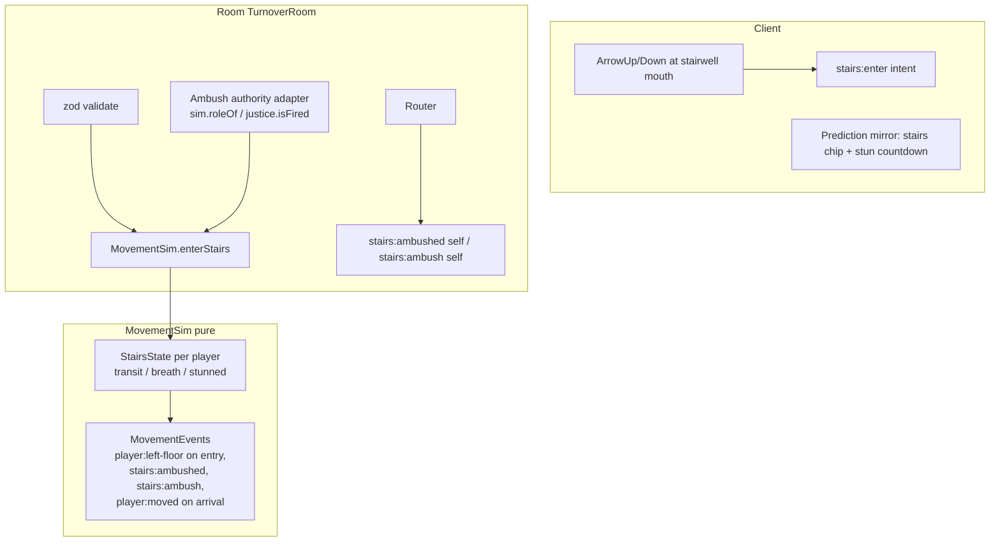

# Stairs Design (cycle 3.E, AD-040)

**Spec**: `.specs/features/stairs/spec.md`
**Status**: Approved (autonomous run — user pre-authorized the cycle)

---

## Architecture Overview

The stairs are a **second transit channel inside the room-owned `MovementSim`**,
parallel to the elevator machinery, plus a one-car collapse of everything
car-indexed. Role knowledge stays in the `RoundSim` (AD-002 seam): the room
injects a narrow ambush-authority adapter into `MovementSim` at round start
(the AD-028 `MovementPort` pattern inverted — room pushes a role view in, the
movement layer stays role-blind between rounds).



**The single surviving car**: `CarId` narrows from `1 | 2` to `1`. Car 1's
landing moves from x=0 (west) to x=30 (east) — the stairwell takes the west
landing — and the compiler's `Record<1 | 2, …>` sites surface every two-car
fallout site. Wire payloads keep the `car` field (always `1`), so registry
payload shapes and client consumers change by deletion, not reshaping.

**Dispatch collapse** (single car, all of AD-019/AD-023's choice predicates
vanish): landing call with the car standing/arriving here → board/pending
(AD-025/026 unchanged); duplicate predicate → flash; car idle → dispatch;
car busy → sim-level FIFO (pinned field now constant); mid-hall call with the
car parked at the pickup → decoy flash (the both-parked case degenerates).

**Stairs channel** (per player, players only):

```typescript
interface StairsState {
  from: FloorId
  to: FloorId
  /** −1 = down, +1 = up (FLOOR_IDS strides). */
  dir: -1 | 1
  phase: 'transit' | 'breath' | 'stunned'
  /** Ticks left of the current phase (transit or breath). */
  ticksLeft: number
  /** Remaining transit ticks — preserved through a stun. */
  transitTicksLeft: number
  stunTicksLeft: number
}
```

- **Entry** (`enterStairs(id, dir)`): kind `player`, not in a car, not already
  in stairs, within `ELEVATOR_LANDING_TILES` of the stairwell mouth (x=0), and
  `dir` has an adjacent floor. Silent-reject otherwise (the client gates with
  the shared affordance predicate). Intent-time, flushed next tick (MOVE-10).
  Emits `player:left-floor {floor: from}` (departure is observable like
  boarding) and the room answers with a personal `movement:snapshot`.
- **Transit**: no floor stream (`viewOf` → floorless, like riders — the
  interior is a black box), no `player:moved`, excluded from `allPositions`
  (spectator baseline — the stairs are camera-free by name, FR-20's overview
  does not rent a camera to them).
- **Arrival**: `floor = to`, `x = 0`, `facingDirty = true` (the arrival floor's
  stream resumes next tick — mirrors `exitCar`), then `breath`
  (`STAIRS_BREATH_SECONDS`, immobile: move/start intents ignored).
- **Ambush** (checked every tick, after timers): for each pair of players both
  in `phase: 'transit'` with opposite `dir`, where the authority adapter says
  exactly one is the saboteur and the other is a live staff member → the staff
  member enters `phase: 'stunned'` for `STAIRS_STUN_SECONDS`, `transitTicksLeft`
  preserved. Emits `stairs:ambushed {playerId, stunSeconds}` (victim) and
  `stairs:ambush {playerId, victimId}` (saboteur). Phase gating makes each
  pair single-fire per stride; multiple opposing staff in one stride each
  trigger. On stun end → `phase: 'transit'`, `ticksLeft = transitTicksLeft`.
- **Buzzer / round end**: the room calls `movement.resolveStairsForResults()` —
  every stairs occupant is placed at their destination floor (stun cleared, no
  breath), so the results snapshot (MOVE-18) shows honest positions.
- **Disconnect mid-stairs**: a mid-round drop HOLDS the seat (FR-25/AD-021) —
  the movement slot is frozen, never left, so the `StairsState` persists and
  the `round:resumed` snapshot re-sends the remaining transit/stun (the
  personal snapshot carries the `stairs` row). `leave()` — expiry, firing,
  or a deliberate leave — deletes the state with the player; a post-expiry
  rejoin is a fresh join. (Verifier gap 1 resolved: the spec's
  continue-the-transit wording describes the seat-hold path and stands;
  this text previously conflated it with the leave path.)

## Code Reuse Analysis

| Component | Location | How to Use |
| --- | --- | --- |
| Intent-time event flush pattern | `movement.ts` `pendingEvents` | Stairs entry events flush next tick |
| Rider floorless policy | `movement.ts` `viewOf`, `snapshotFor` | Stairs occupants reuse the exact floorless shape |
| `player:left-floor` | registry `'sameFloor'` row | Stairs entry reuses it verbatim — no new departure message |
| AD-017 exit-snapshot mechanism | `TurnoverRoom.ts` move:start handler | Room pushes a personal snapshot on stairs entry too |
| AD-028 adapter pattern | `TurnoverRoom.ts` MovementPort | Same inversion for the ambush authority |
| AD-037 affordances module | `packages/shared/src/affordances.ts` | `atStairwellMouth`, `stairsDirections(floor)` — both sim guard and client mirror consume them |
| Presenter / panels / lights | `elevatorPresenter.ts`, `WorldScene.ts`, `lobbyView.ts`, `roundHud.ts` | Car-keyed maps shrink to one entry — mostly deletions |
| Harness press-retry pattern | `apps/client/harness/*` (AD-028) | `client:stairs` scenarios drive the single car through ambient guest traffic |

## Components

### MovementSim stairs channel
- **Purpose**: pure stairs transit/breath/stun state machine + ambush detection.
- **Location**: `packages/sim/src/movement.ts`.
- **Interfaces**: `enterStairs(id, dir): 'entered' | 'ignored'`,
  `setAmbushAuthority(a: { isSaboteur(id): boolean; isLiveStaff(id): boolean } | null)`,
  `resolveStairsForResults()`, `stairsStateOf(id)` (snapshot/tests).
- **Dependencies**: `FLOOR_IDS`, `TUNING`, `TICK_HZ`.
- **Reuses**: pendingEvents flush, floorless view policy, facingDirty arrival.

### Ambush authority adapter
- **Purpose**: role/liveness view without leaking roles into movement.
- **Location**: `apps/server/src/rooms/TurnoverRoom.ts` (wired at round start,
  cleared at results).
- **Dependencies**: `RoundSim.roleOf`, `justice.isFired`.
- **Contract**: `isSaboteur(id)` true only for the round's live saboteur;
  `isLiveStaff(id)` true for round players who are neither fired, ghosted,
  nor the saboteur. Both `false` whenever `sim === null` (no ambush outside a
  round).

### Protocol rows
- **Location**: `packages/shared/src/protocol/{messages,simEvents,registry}.ts`.
- **New MovementEvents**: `stairs:ambushed {playerId, stunSeconds}`,
  `stairs:ambush {playerId, victimId}` — both registry rows `'self'` (the
  victim's payload names no one; the saboteur's own knowledge is legitimate).
- **Snapshot widening**: `MovementSnapshot.stairs?` — present only while the
  recipient is in stairs (`{from, to, phase, remainingSeconds}`); absent
  otherwise (pre-3.E payloads byte-identical).
- **Intent**: `stairs:enter {dir: 'up' | 'down'}` — zod schema beside
  `elevatorCallIntentSchema`.

### Client slice
- **Location**: `apps/client/src/scenes/*`, `apps/client/src/ui/*`.
- **Content**: single-car presenter/panels/lights (deletions); DOM stairwell
  marker at the west landing on every floor view (the AD-018 doors-layer
  pattern); stairs chip (rider-chip analog) fed by the own `stairs` snapshot
  state + local countdown; ambush toast ("you were ambushed" + stun
  countdown) and saboteur confirmation line; input: ArrowUp/Down near the
  stairwell mouth → `stairs:enter`, E alias for the only valid direction on
  terminal floors (the AD-037 E-ladder tables).

## Error Handling Strategy

| Error Scenario | Handling | User Impact |
| --- | --- | --- |
| `stairs:enter` from mid-hall / in a car / already in stairs / guest | Silent ignore (sim returns `'ignored'`) | Nothing happens; the client's own gate prevents this in stock play |
| Invalid direction at a terminal floor | Silent ignore; E alias maps to the only valid direction | Nothing happens |
| Ambush authority unset (pre-round/results) | Adapter yields `false` — no ambush | Stairs are a plain transit |
| Reconnect mid-transit/mid-stun | `round:resumed` + personal snapshot carry the remaining state | Stun/transit continue honestly |

## Risks & Concerns

| Concern | Location | Impact | Mitigation |
| --- | --- | --- | --- |
| `movement.ts` is the most-amended file (AD-012…027 all pinned here); the car collapse touches ~40 call sites | `packages/sim/src/movement.ts` | Regression in elevator behavior | `CarId` narrowing makes tsc enumerate every site; the 323-test movement baseline pins unchanged behavior |
| Ambient guest traffic breaks static-car harness assumptions (AD-028 lesson) | `apps/client/harness/*` | Flaky `client:stairs` | Reuse the press-retry pattern; drive the stairs with a dedicated player |
| Ambush determinism depends on tick-order (intent lands between ticks) | `movement.ts` tick | Boundary misses (victim arrives the tick the saboteur enters) | Pinned as deterministic behavior by a sim scenario — "both transiting at the same tick check" is the rule |
| `player:left-floor` at stairs entry is also the elevator-boarding signal | registry | Clients could conflate W-departure with boarding | Client renders both as "left the floor" — the west-vs-east x of the departure is already known from the last `player:moved` |

## Tech Decisions (feature-local)

| Decision | Choice | Rationale |
| --- | --- | --- |
| Ambush authority shape | Room-injected predicate pair, not a MovementEvent round-trip | Keeps detection pure/deterministic in vitest without the room; roles never enter movement state |
| `CarId` narrows to `1` | Type-level deletion, not runtime-only | Compiler finds the fallout; payloads keep the field (AD-040) |
| Stairs occupants excluded from `allPositions()` | Spectator baseline omits them | "Camera-free" is the product name; FR-20 grants rooms, not the stairwell |
| Stun does not interact with suitcases | No drop, clock runs | Stun is a pause, not a foul (spec assumption) |
| Arrival emits no dedicated event | `facingDirty` next-tick `player:moved` | Mirrors `exitCar`; own arrival is self-visible via the sameFloor stream |

No new project-level ADs — AD-040 already records every convention this
feature sets.
