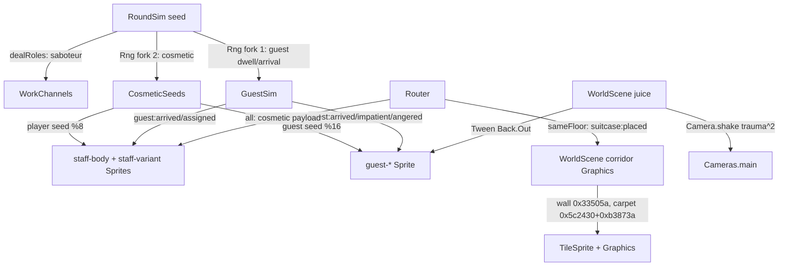

# Phase 4.1 Visual Polish Design

**Spec**: `.specs/features/visual-polish-4-1/spec.md`
**Status**: Draft

---

## Architecture Overview

Rendering-only polish over the landed `960×576 / 32px/tile` world (`AD-030`). Sim assigns a public `cosmeticSeed` (decorrelated Rng fork) → registry `'all'` payloads → client derives **two `Sprite`s per player** (`staff-body` + `staff-variant` overlay, same `flipX`) and **one `guest-*` Sprite per NPC**. Corridor is `Graphics` (wall/chevron) + `TileSprite` (carpet) behind the landed `door`/`elevator` Images. Juice is `Tween` + `Camera.shake` (never body shake) + `Graphics` dust. Zero sim/tuning change besides the seed field.



---

## Code Reuse Analysis

### Existing Components to Leverage

| Component | Location | How to Use |
|---|---|---|
| `Rng` seeded sampling | `packages/sim/src/rng.ts:11` | Fork `new Rng(seed ^ 0x9e3779b9)` for cosmetic stream — same `mulberry32` `deal.ts:7` lineage, deterministic `rng.test.ts:4` |
| `dealRoles` Fisher-Yates | `packages/sim/src/deal.ts:21` | Keep verbatim; cosmetic stream is a **separate** `Rng` so role deal never shifts |
| Guest economy `GuestSim` | `packages/sim/src/guests.ts:18` | Reuse arrival/assignment plumbing; add `cosmeticSeed` map alongside existing `rng` sampling `guests.ts:182` |
| Protocol registry `PROTOCOL_REGISTRY` | `packages/shared/src/protocol/registry.ts:237` | Add two rows `cosmetic:player` + `cosmetic:guest` or piggy-back on `role:dealt`/`guest:arrived` payloads with `'all'` policy; `SimProjection` typed per key `registry.ts:215` |
| `WorldScene` player display | `apps/client/src/scenes/WorldScene.ts:112` `PlayerDisplay` `{sprite,label,x,floor,targetX,left,facing}` | Extend to `{body: Sprite, variant: Sprite}` pair; keep `addPlayerDisplay` `1185`, `laneY` `690`, `spectator` `68` lanes |
| Corridor band precedent | `WorldScene.ts:312` `TileSprite 0,350 960x146 depth -2` + `wallFill Graphics depth -3` `721` | Reuse depths; add `Graphics` chevron `16px pitch` on `wallFill` |
| Elevator presenter clock | `apps/client/src/scenes/elevatorPresenter.ts:28` cosmetic overlay counter | Keep as single clock authority `AD-038`; no touch |
| Art pipeline deterministic Pillow | `scripts/art/generate-staff-walk.py`, `docs/art/asset-manifest.json:6` `staff-walk 28×60 8f` | Copy pattern for `34×64 6f+idle` sheets `generate-alternative-styleboard.py` style |
| Deco Noir palette locks | `docs/art/alternative/art-direction-brief.md:80` exact swatches | Paste verbatim — wall `0x33505a`, carpet `0x5c2430/0xb3873a`, night `0x0f1b21`, ivory/brass guards |

### Integration Points

| System | Integration Method |
|---|---|
| `packages/sim` → `packages/shared` protocol | New `SimEvent cosmetic:*` or payload extension on existing events; `registry.ts` `Entry` with `'all'` recipients `72` |
| `apps/server` Router | Apply `'all'` recipient generically `turnover-protocol` skill; stamp `Envelope {seq,time}` `94` |
| `apps/client` `state.ts` `SceneAction` | Add `cosmetic-assigned` mapper → `WorldScene.applyAction` `779` switch; `ViewAction` exhaustive `Record<RegistryKey, Mapper>` `AD-006` |
| `apps/client` `BootScene` preload | Queue `staff-body`, `staff-variant`, `guest-*` sheets before `WorldScene.create` `phaser-core` skill lifecycle |
| `vitest` sim + `playwright` harness | `sim:variant_decorrelation` + `client:char_variants` `client:corridor_depth` `client:juice_small` `client:camera_juice` per `turnover-gates` skill |

---

## Components

### CosmeticSeed Assignor

- **Purpose**: Assign stable decorrelated `u32` per player and per guest at creation time
- **Location**: `packages/sim/src/cosmetic.ts` (new pure module) + `packages/sim/src/roundSim.ts:114` deal site, `packages/sim/src/guests.ts:202` guest spawn
- **Interfaces**:
  - `variantIndex(seed: number, buckets: number): number` — `seed % buckets` pure function (8 staff, 16 guest)
  - `assignPlayerSeeds(seed: number, playerIds: readonly string[]): Map<string, number>` — `new Rng(seed ^ COSMETIC_FORK)` then `rng.int(0xFFFFFFFF)` per id, sorted ids for determinism
  - `assignGuestSeed(cosmeticRng: Rng): number` — single `rng.int` draw at `guest:arrived` tick
- **Dependencies**: `Rng` `rng.ts:11`, `mulberry32` `deal.ts:7`
- **Reuses**: Guest seeded-stream pattern `AD-028`; `dealRoles` Fisher-Yates isolation

### Protocol Cosmetic Payloads

- **Purpose**: Public identity variety that never carries role
- **Location**: `packages/shared/src/protocol/messages.ts` (payload interfaces), `simEvents.ts` (SimEvent union), `registry.ts:101` Payloads + `237` registry rows
- **Interfaces**:
  - `interface CosmeticPlayer { playerId: string; seed: number }` payload for `'cosmetic:player'`
  - `interface CosmeticGuest { guestId: string; seed: number }` payload for `'cosmetic:guest'`
  - Alternative: widen `RoleDealt {role, seed}` and `GuestArrived {guestId, seed}` — decide at impl; spec allows either as `'all'` public payload
- **Dependencies**: `RecipientPolicy 'all'` `registry.ts:72`
- **Reuses**: `GuestAssigned 'all'` `131` precedent; `SimProjection<K>` typing `215`

### Staff Variant Renderer

- **Purpose**: Render each player as body + variant overlay, decorrelated from role, with `flipX` parity and identical walk timing
- **Location**: `apps/client/src/scenes/WorldScene.ts:112` `PlayerDisplay` → `{body: Sprite, variant: Sprite, label}`, `apps/client/src/scenes/BootScene.ts` preload
- **Interfaces**:
  - `variantIndexOf(seed: number): number` — `seed % 8` client mirror (tests pin equality with sim)
  - `addPlayerDisplay(id,name,seed): void` — `add.sprite(x*TILE_PX, GROUND_Y, 'staff-body')` + `add.sprite(..., 'staff-variant')` `setOrigin(0.5,1)` `setDepth(playerDepth)`; `variant.setFrame(variantIndex*6 + animFrame)` or sheet per variant `staff-variant-{0..7}`
  - `updateFacing(id, facing): void` — `body.flipX = variant.flipX = facing==='left'`
- **Dependencies**: `staff-body 34×64 6f+idle` + `staff-variant 34×64` sheets `pixelArt:true` `main.ts:12`
- **Reuses**: `ART-01..04` `art-swap/spec.md` player sprite contract; `WorldScene.ts:322` anim `staff-walk 12fps` pattern

### Guest Archetype Renderer

- **Purpose**: Replace `Arc` markers with silhouette+tint sprites, never staff livery
- **Location**: `apps/client/src/scenes/WorldScene.ts:137` `guests Map` + `206 guestViews Map<Arc>` → `Map<Sprite>`, `evidenceSession` unrelated
- **Interfaces**:
  - `guestVariantOf(seed: number): {archetype: 0..3, palette: 0..3}` — `seed % 16` split: `archetype = seed%4`, `palette = (seed>>>2)%4`
  - `createGuestView(guestId,floor,x,seed): Sprite` — `texture = 'guest-'+archetype`, `tint = GUEST_PALETTES[palette]` (teal/burgundy/ochre/slate, no `0xf2ead8/0xc9a13b`)
- **Dependencies**: `guest-moved` `sameFloor` policy `registry.ts:284`
- **Reuses**: `GUEST_FILL/DINING_FILL` `WorldScene.ts:59` tint lineage; `guest:impatient` foot-tap hook for juice

### Corridor Deco Renderer

- **Purpose**: Wall/chevron/carpet/sconce pools as authored art + `Phaser.Graphics`
- **Location**: `apps/client/src/scenes/WorldScene.ts:311` `corridorBand` + `721 wallFill` + new `Graphics` chevron overlay
- **Interfaces**:
  - `drawCorridor(): void` — `wallFill.fillStyle(0x33505a).fillRect(0,48,960,302)` `wallFill.depth=-3` + `chevron Graphics lineStyle(1,0x8a6a2f) 16px pitch` + `corridorBand TileSprite 0,350 960x146 depth -2` + sconce pool `Graphics fillStyle(0xf4d9a0,0.15) ellipse 48×16 per door`
- **Dependencies**: `TILE_PX 32` `54`, `ROOM_HALL_START_TILES` layout
- **Reuses**: `WorldScene.ts:307` hall line `Graphics` precedent; Deco Noir palette `brief.md:80`

### Juice Controller

- **Purpose**: Small transient exaggeration — walk settle, foot-tap, anger pop, camera shake
- **Location**: `apps/client/src/scenes/WorldScene.ts:1090` `playRustleFx` precedent + new `juice.ts` presenter (pure, testable) or inline Tweens
- **Interfaces**:
  - `juiceSettle(sprite: Sprite): Tween` — `tween {scale: 1→1, ease: Cubic.easeOut 180ms}` (the pop is the scale return from `0.95→1`)
  - `juiceFootTap(sprite: Sprite): Tween` — `tween {y: base±1, yoyo:true, repeat:-1, ease: Sine.easeInOut 400ms}`
  - `juiceAnger(x,y): {sprite: Sprite, tween: Tween}` — `scale 0→1.3→1 Back.Out 220ms TTL 1800ms` + `Graphics dust 4× {alpha:0.6→0, x+rand*8, duration 300}`
  - `shakeFor(reason: 'fired'|'ambushed'|'none'): void` — `cameras.main.shake(140,0.008)` only for `fired/ambushed`, `trauma^2` decay, no body offset `game-feel` skill
- **Dependencies**: `Phaser.Tweens`, `Phaser.Cameras.Scene2D.Camera:shake`
- **Reuses**: `fx-rustle 4f` particle pattern `WorldScene.ts:326`; `elevatorPresenter` clock authority `AD-038` — juice never owns elevator ticks

---

## Data Models (if applicable)

### CosmeticSeed (sim)

```typescript
interface CosmeticSeed {
  playerId: string // or guestId
  seed: number     // u32, rng.int(0xFFFFFFFF) from decorrelated Rng
}
// Mapping is pure: variant = seed % buckets
const STAFF_BUCKETS = 8   // 2 skin ×2 hair ×2 accessory
const GUEST_BUCKETS = 16  // 4 archetypes ×4 palettes
```

**Relationships**: `RoundSim` owns `Map<string, CosmeticSeed>` for players (at deal, `roundSim.ts:114`); `GuestSim` owns `Map<string, number>` for guests (at `guest:arrived`, `guests.ts:640` dwell analog). Both are public and travel via registry `'all'`; neither enters `WorkChannels` or `Justice`.

### VariantSprite (client)

```typescript
interface PlayerDisplay {
  body: Phaser.GameObjects.Sprite    // 'staff-body' 34×64
  variant: Phaser.GameObjects.Sprite // 'staff-variant' 34×64 overlay, same origin/flipX
  label: Phaser.GameObjects.Text
  x: number; floor: FloorId; targetX: number|null; left: boolean; facing: Facing
}
interface GuestDisplay {
  sprite: Phaser.GameObjects.Sprite // 'guest-{archetype}' tinted
  impatienceTween: Phaser.Tweens.Tween | null
}
```

---

## Error Handling Strategy

| Error Scenario | Handling | User Impact |
|---|---|---|
| `cosmeticSeed` payload missing (old replay / malformed JSONL) | Client fallback `seed=0 → variant 0`; sim never emits undefined `rng.int` guarded | Player renders (default bellhop), no throw |
| Texture `staff-body`/`guest-*` not in cache (`textures.exists` false) | Keep `Graphics` corridor + `Text` label fallback `WorldScene.ts:317` precedent; log `console.warn` dev-only | Scene stays interactive, no black screen |
| `variant % buckets` out of range (future bucket change) | `Math.abs(seed) % buckets` clamp; never negative index | No crash, variant cycles |
| `guest:moved` for unknown `guestId` before `guest:arrived` (out-of-order envelope gap) | Drop move, keep map entry lazily on next `guest:arrived`; envelope gap triggers rejoin per `Router` `AD-006` | No ghost sprite |
| `roomDoorXMilli(0)` on `mezzanine` (no rooms) anger spawn | Guard `if room===0 return` — no `Graphics` at `x=NaN` | No stray cue |

---

## Risks & Concerns

| Concern | Location (file:line) | Impact | Mitigation |
|---|---|---|---|
| `Rng` fork collides with guest dwell stream and shifts 3.1 seeded expectations | `packages/sim/src/guests.ts:202` `new Rng(seed)` single stream; adding a second draw changes every later draw | Determinism drift — `guestExit` `AD-043` `sim:guest_exit_a 20/20` could flip | **Fork on `seed ^ 0x9e3779b9` into a dedicated `cosmeticRng`**; keep `guests.ts` `this.rng` verbatim — cosmetic draws never touch the guest timing stream; pin with a no-Math.random test `guestExit.test.ts:289` analog |
| `PlayerDisplay` grows from 1 Sprite to 2 Sprites — lerp/position write must move both | `WorldScene.ts:859` `display.x =` + `sync` loop writes `sprite.x` only | Variant drifts behind body | Design: single `setPosition(x*TILE_PX, laneY)` helper that moves both `body`+`variant`; `applyAction` and `update lerp` call it; task adds `position_parity` harness assertion |
| Staff palette leak via variant overlay (ivory/brass accidentally on guest, or variant uses brass button on accessory that guest reuses) | `docs/art/alternative/asset-manifest.json:47` `staff-variant` sheets + `GUEST_PALETTES` tints | Class-read gate `VPOL-07` fails — guest reads as staff | Palette denylist test samples guest sprite pixels (`asset_report.py --max-colors`) and asserts no `0xf2ead8/0xc9a13b` dominants; staff `body` never tinted per guest palette |
| `Graphics` chevron per frame vs once — perf on 60fps `update` | `WorldScene.ts:713` `drawHallLines` called every `applyViewMode` only; new chevron must not be redrawn in `update` | Jank on low-end browsers | Draw once in `create`/`applyViewMode` only; `update` touches only Tweens and lerp; no `Graphics.clear` in `update` |
| Spectator overview lane `SPECTATOR_LANE_Y:68` `floor3:80` etc. needs variant sprites per lane with same pairing | `WorldScene.ts:736` `seedFromSpectatorSnapshot` seeds positions but not variants | Fired overview shows gray-box fallback | Snapshot must carry `cosmeticSeeds` (player+guest maps) alongside `players`/`tenancies`; `seedFromSpectatorSnapshot` creates `body+variant` per lane; harness asserts lane count equals `playerIds.length` Sprites |

---

## Tech Decisions (only non-obvious ones)

| Decision | Choice | Rationale |
|---|---|---|
| Piggy-back vs new registry rows for `cosmeticSeed` | **New rows `cosmetic:player` + `cosmetic:guest`** (`'all'`) over widening `role:dealt`/`guest:arrived` | Keeps `role:dealt` `'self'` (secret) and `cosmetic` `'all'` (public) policies orthogonal; `PROTOCOL_REGISTRY` audit stays one-row-per-intent `AD-006` — the widen alternative would make one row two policies |
| Variant sheets shape | `staff-body 34×64 6f` shared + `staff-variant 34×64 8×6f` (or `8` head strips `34×20` overlaid) | Second option is lighter — variant layer is head only, body anim drives both; choose at impl based on Pillow authoring cost — either satisfies `bottom-center` `AD-030` grid |
| Guest sprite count | `4` base PNGs × tint, not `16` PNGs | `≤12` sheet budget `brief.md:138` — tints keep budget; Phaser `setTint` is `nearest` safe for flat fills |
| Juice ownership | `WorldScene` owns Tweens, `juice.ts` pure presenter owns durations/eases (testable) | Keeps `WorldScene.ts` from ballooning; `juice.test.ts` can assert `Back.Out 220ms TTL 1800` without booting Phaser |
| Shake impl | `Cameras.main.shake` `game-feel` trauma^2, not manual `offset` sin | Phaser 4 `Camera.shake` is the engine's trauma wrapper; manual `offset` would fight `startFollow` lerp `phaser-core` skill — shake is the only juice `camera-systems` delegates to |

> **Project-level decisions:** None new — this cycle stays within `AD-020` sheet contracts, `AD-029` Deco Noir palette, `AD-030` `32px/tile`. If variant `34×64` elongation required a new `TUNING` or `layout` constant, it would append `AD-NNN`, but it is client-only rendering (`TILE_PX` already 32, `main.ts:12` `pixelArt`).

