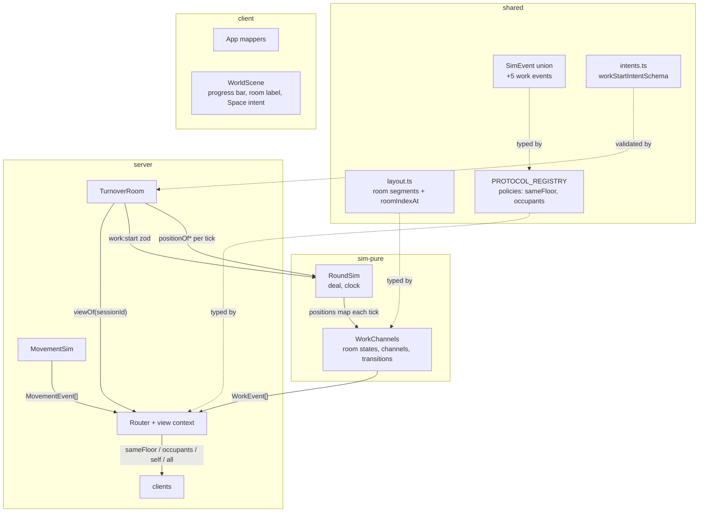

# Work Channels Design

**Spec**: `.specs/features/work-channels/spec.md`
**Status**: Approved (AD-009/AD-010 recorded in `.specs/STATE.md` before this design)

---

## Approach

One real decision: where the work layer lives and how it learns positions.

| Approach | Verdict | Reason |
| --- | --- | --- |
| **A (chosen)**: `WorkChannels` module inside `packages/sim`, composed by `RoundSim`; the room feeds positions in each tick | ✅ | AD-002/AD-005: the sim owns the round (roles, work, clock) and consumes positions from the movement layer through a pure data seam. Determinism, gate-2 scenario format, and role knowledge (the deal) all live in the sim already |
| B: work state in the room (like the movement layer) | ❌ | Work is round-scoped and role-gated — the room would need the deal, violating AD-002 ("roles were the sim's alone"); lobby-phase churn would contaminate it |
| C: sim queries positions via injected callback (`() => positionOf`) | ❌ | Breaks "inputs + time in, events out" purity — hidden inputs make scripted replay non-obvious; an explicit per-tick positions map keeps `tick()` a pure function of its arguments |

## Architecture Overview

### The position seam (AD-005 made concrete)

`RoundSim.tick(positions?: RoundPositions)` — `RoundPositions = ReadonlyMap<string,
{ floor: FloorId; x: number }>` (x in **millitiles**, matching the movement sim's
internal unit; the room derives it from `movement.positionOf`). Optional parameter:
`undefined` behaves as an empty map, so every pre-2.5 `tick()` call site and test
still compiles. The buzzer/first-tick semantics are unchanged; work events join the
same returned event array.

## Components

### Layout — `packages/shared/src/layout.ts` (edited, AD-010)

- `ROOM_DEPTH_TILES = 3.5` (re-derived from 4; 8 × 3.5 = 28 exactly tiles `[1, 29]`),
  plus `ROOM_HALL_START_TILES = 1` and derived `ROOM_SEGMENT_MILLI(i)` helpers:
  segment i (1-based) = `[1000 + 3500·(i−1), 1000 + 3500·i)` millitiles, last room
  inclusive end. Export `ROOMS_PER_FLOOR` (8, unchanged), `GUEST_FLOOR_IDS`.
- `roomIndexAtMilli(xMilli): 0 | 1..8` — 0 = outside every segment. Pure, shared by
  sim (server-authoritative truth) and client (Space-key intent derivation).

### WorkChannels — `packages/sim/src/work.ts` (new, pure)

- `new WorkChannels(deal: ReadonlyMap<string, Role>)` — 24 rooms init `'fresh'`
  (AD-010: layout constants; prd FR-3), no active channels.
- `startWork(playerId, floor, room): 'accepted' | 'not-in-room' | 'room-not-workable'
  | 'channel-active'` — validates inside-segment (floor + x from the last positions
  map), role/action/state matrix (staff: fresh|trashed→prep 100 ticks; saboteur:
  prepped→unprep 60 ticks, fresh|trashed→fake 100 ticks), one channel per player.
  The room maps rejections to `error` intent codes 1:1.
- `leave(playerId)` — drop their channel silently (WORK-12).
- `tick(positions): readonly WorkEvent[]` — per tick: (1) walk-out cancels for
  channeling players whose position left their channel's segment (exactly one
  `work:ended` 'cancelled', WORK-11); (2) channel countdowns; completions apply
  transitions in channel-start order (deterministic, spec edge) emitting
  `room:prepped`/`room:trashed` + `work:ended` 'completed' — fake prep emits only
  `work:ended`; (3) segment-crossing observation: for each player on a guest floor,
  `roomIndexAtMilli` change ⇒ `room:observed` (self policy, WORK-14). Idle ticks
  emit `[]`.
- Channel record: `{ playerId, floor, room, kind: 'prep'|'unprep'|'fake', ticksLeft }`.
  `kind` never leaves the sim as anything but the actor's own `work:started.seconds`
  (100/60) — indistinguishability (WORK-10) is structural: no event names `kind`.

### RoundSim — `packages/sim/src/roundSim.ts` (edited)

- Owns a `WorkChannels` built from the deal; delegates `startWork`/`leave`;
  passes positions to it inside `tick()`; work events append to the tick's event
  array (buzzer tick may carry both `round:buzzer` and final-tick work events —
  channels that complete on the buzzer tick complete; later ticks emit nothing).

### Registry — `packages/shared/src/protocol/registry.ts` (edited)

- `RecipientPolicy` extends to `'all' | 'self' | 'sameFloor' | 'occupants'`
  (AD-006's deliberate-extension rule; first consumers this cycle).
- `SimProjection` return gains optional `visibility: { floor?: FloorId; roomKey?: string }`.
- Rows: `player:moved` → `'sameFloor'` (AD-009) with `visibility: { floor }`;
  `room:prepped`/`room:trashed` → `'occupants'` with `visibility: { roomKey }`
  (`roomKey = \`${floor}:${room}\``); `work:started`/`work:ended`/`room:observed` →
  `'self'` (fromSim sets `self: event.playerId`); `elevator:*`/`player:left` stay
  `'all'`. satisfies clause extends over the widened SimEvent union automatically.
- `IntentError` codes gain `'not-in-room' | 'room-not-workable' | 'channel-active'`.

### Router — `apps/server/src/rooms/router.ts` (edited)

- `setViewContext(fn: (sessionId) => { floor: FloorId | null; roomKey: string | null })`
  — the room registers a provider built from the movement sim: live player ⇒ own
  floor (riders ⇒ `null`), plus current segment key (`null` outside segments).
- `dispatch()` gains the two positional branches: `sameFloor` delivers to clients
  whose `view.floor === visibility.floor`; `occupants` to clients whose
  `view.roomKey === visibility.roomKey`. `all`/`self` unchanged. The Router still
  never names a message type; policy + visibility come from the registry row.

### MovementSim — `packages/sim/src/movement.ts` (one addition)

- `snapshotForFloor(floor: FloorId): MovementSnapshot` — players on `floor` only
  (WORK-18), cars unchanged. Existing `snapshot()` stays for sim tests; the room
  switches join/buzzer sends to the filtered variant.

### TurnoverRoom — `apps/server/src/rooms/TurnoverRoom.ts` (edited)

- `onCreate`: `router.setViewContext(sessionId => …)` from `movement`; `work:start`
  zod handler → phase guard (lobby ⇒ `round-not-active`… reuse `'elevator-locked'`-
  style code `'round-not-active'` added to IntentError) → `sim.startWork` (round
  inactive pre-sim ⇒ same rejection) → rejection codes 1:1.
- `advance()`: build the positions map (`movement.positionOf` per player) and pass
  to `sim.tick(positions)`.
- `onLeave`: `sim?.leave(sessionId)` (mid-round, before the roster delete fallout).
- Buzzer: unchanged — snapshot refresh now uses `snapshotForFloor` per connection.
- Fold-in (room-shell verifier notes, this file's tests): LOBBY-02 "create no room"
  clause is a join-rejection surface already covered; rejected-start re-assertion
  (reject-then-start mutant leg) and LOBBY-05 roster-unchanged-after-name-rejection
  get direct assertions in `TurnoverRoom.test.ts`.

### Client — `apps/client/src/` (edited)

- Mappers: the five new messages are **scene-kind** actions (like `player:moved`) —
  reducer returns state identity (no view transition); App routes them to
  `WorldScene`. `error` codes render via the existing banner.
- `WorldScene`: (1) Space keydown ⇒ if own predicted position is inside a guest-floor
  segment (`roomIndexAtMilli`), send `work:start {floor, room}`; (2) `work:started`
  ⇒ show the DOM progress bar (`#work-progress`) filling over `seconds`;
  `work:ended` ⇒ hide it ('completed' keeps a brief filled state); (3) `room:observed`
  / `room:prepped` / `room:trashed` ⇒ surgical `textContent` update of the room label
  (`#room-state`) while the own rectangle is inside that segment; leaving the segment
  hides the label (scene-local, no server event needed — the server sends nothing
  outside rooms either). Visuals are identical regardless of the underlying channel
  kind (FR-9) because the scene never learns `kind`.
- Harness contract preserved: scene children remain exactly player Rectangles + car
  Ellipses; progress bar and room label are DOM overlay elements.

---

## Data Models

### Work events (join the SimEvent union — registry exhaustiveness forces the rows)

| Wire name | Payload | Recipients | Source |
| --- | --- | --- | --- |
| `work:started` | `{ playerId, floor, room, seconds }` | `self` | WorkChannels via `fromSim` |
| `work:ended` | `{ playerId, floor, room, outcome: 'completed' \| 'cancelled' }` | `self` | WorkChannels |
| `room:observed` | `{ playerId, floor, room, state }` | `self` | WorkChannels (crossing detection) |
| `room:prepped` | `{ floor, room }` | `occupants` | WorkChannels |
| `room:trashed` | `{ floor, room }` | `occupants` | WorkChannels |

Amended row: `player:moved` `{ playerId, floor, x, facing }` → `'sameFloor'`.

### Intents (zod, outside the registry)

`work:start { floor: 'floor1'|'floor2'|'floor3', room: 1..8 }`

---

## Error Handling Strategy

| Error Scenario | Handling | User Impact |
| --- | --- | --- |
| `work:start` in lobby phase / before host start | `'round-not-active'` error | Banner |
| Player outside the named segment (or wrong floor / in car) | `'not-in-room'` | Banner |
| Action/state mismatch (staff on prepped, saboteur… all covered by matrix) | `'room-not-workable'` | Banner |
| Channel already active for the player | `'channel-active'` | Banner |
| Walk-out mid-channel | `work:ended` 'cancelled', state unchanged (WORK-11) | Progress bar clears |
| Leave mid-channel | Silent drop (WORK-12) | None |
| Buzzer mid-channel | Dies with the sim, no event (WORK-13) | Snapshot refresh |

---

## Risks & Concerns

| Concern | Location | Impact | Mitigation |
| --- | --- | --- | --- |
| Harness shift seam too short for a full walk+ride+prep scenario | `apps/client/harness/playwright.config.ts` (TURNOVER_TEST_SHIFT_SECONDS=8) | `client:work_channels` can't finish before the buzzer | Raise the webServer env to 30 s for the whole suite; LIGHT-13/14 (buzzer) poll for the buzzer so they stay correct — suite adds wall time only on those tests. AD-004's seam is env-configurable by design; recorded here, not a new AD |
| `room:observed` on walk-through makes pass-through crossings informative | WorkChannels crossing detection | FR-10's letter says inside ⇒ readable; 2.6's door cues will make pass-through audible anyway | Accepted — reading while inside is the spec'd behavior |
| sameFloor routing breaks 2.4 tests that asserted global delivery | server/client tests | Gate churn | T2 amends those assertions with the registry change (AD-009 is the recorded authority) |
| Concurrent same-room transitions ordering | WorkChannels completion loop | Hidden nondeterminism | Apply in channel-start order (insertion order of the channel map); asserted by a scripted same-tick test |
| Registry literal-policy drift (protocol-registry N2) | `registry.test.ts` | Policy walk only pins membership | Fold-in: add a literal per-key policy walk in T1's registry tests |

---

## Tech Decisions (only non-obvious ones)

| Decision | Choice | Rationale |
| --- | --- | --- |
| Positions as explicit tick input | `RoundSim.tick(positions?)` map | Purity preserved (approach C rejected); optional param keeps every existing call site compiling |
| Segment predicate in millitiles | Integer segments `1000 + 3500·i` | 3.5 tiles × 1000 is exact; matches the movement sim's integer-millitile determinism |
| Fake prep indistinguishability | No event names `kind`; duration rides as the actor's own `seconds` | Structural, not conventional — nothing to grep, nothing to leak (WORK-10, protocol rule 3) |
| `occupants` computed per event, not per room cache | Router filters live clients by view context at dispatch | No stale-cache bugs at the transition tick; occupancy is exactly "inside the segment at the transition tick" (WORK-15) |
| Room label ownership in the scene, not the reducer | Scene hides the label on segment exit | The reducer never sees positions (2.4 decision); segment membership is position-derived state — same home |
| AD-009 routing in the Router, not the room | Policy + visibility in the registry row; room only supplies the view context | The registry stays the single audit surface (protocol rule 5); no per-type switch anywhere |
